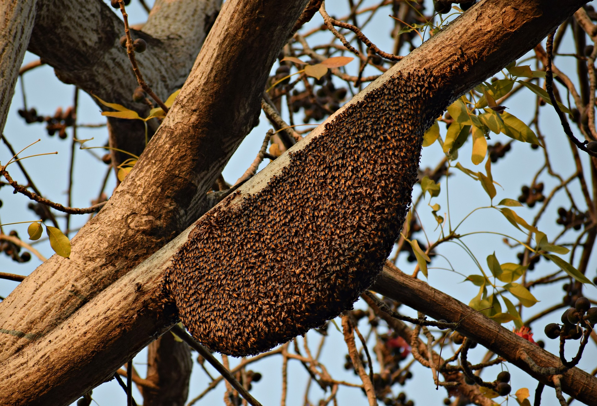

```{r setup, include=FALSE}
options(htmltools.dir.version = FALSE)
```


# Visualizing a Single Distribution

- Histogram

- Density plot

- Cumulative density

- Quantile-Quantile plot

> Cumulative density and Quantile-Quantile plot are hard to interpret.
---

# Visualizing multiple distributions

.pull-left[

**Visualization of distributions along the X-axis**

- Boxplots

- Violins

- Strip charts

- Sina plots

]

.pull-right[

**Visualization of distributions at the same time**

- Staked histograms

- Overlapping densities

- Ridgeline plot

]
---
# Histogram - Binwidth

```{r, echo=FALSE, message=FALSE, warning=FALSE}
library(tidyverse)
```

```{r, echo=FALSE}
# Generate sample data 
set.seed(25052020)
# normal
s1 <- rnorm(100)
s2 <- rbeta(100, 2, 1)
s3 <- rexp(100)
# mixture
s4 <- rnorm(100, rep(c(-1, 1), each = 50) * sqrt(0.9), sqrt(0.1))
four <- data.frame(
dist = factor(rep(c("s1", "s2", "s3", "s4"),
each = 100),
c("s1", "s2", "s3", "s4")),
vals = c(s1, s2, s3, s4)
)


```

```{r, comment=NA, message=FALSE, echo=FALSE}
ggplot(four, aes(x = vals)) + 
geom_histogram(fill = "orange", colour = "black") + 
coord_cartesian(xlim = c(-3, 6)) + 
facet_wrap(~ dist) 
```

---
# Histogram-Binwidth (.1)

**Narrow**

```{r, comment=NA, message=FALSE, echo=FALSE}
ggplot(four, aes(x = vals)) +
geom_histogram(binwidth = .1, fill = "orange", colour = "black") +
coord_cartesian(xlim = c(-3, 6)) +
facet_wrap(~ dist)

```
---

# Histogram-Binwidth (2)

**Wide**

```{r, comment=NA, message=FALSE, echo=FALSE}
ggplot(four, aes(x = vals)) +
geom_histogram(binwidth = 2, fill = "orange", colour = "black") +
coord_cartesian(xlim = c(-3, 6)) +
facet_wrap(~ dist)

```
---

# Add a rug

```{r, comment=NA, message=FALSE, echo=FALSE}
ggplot(four, aes(x = vals)) +
geom_histogram(binwidth = .2, fill = "orange", colour = "black") +
geom_rug() +
coord_cartesian(xlim = c(-3,6)) +
facet_wrap(~ dist)
```

---
# Histogram - Example

```{r, comment=NA, message=FALSE, fig.height=5}
ggplot(iris, aes(x = Sepal.Length)) +
geom_histogram(binwidth = .2, fill = "orange", colour = "black") +
geom_rug() +
facet_wrap(~ Species)
```
---

# Boxplot 

**Medium to Large N**

```{r, echo=FALSE, comment=NA}
ggplot(four, aes(y = vals, x = dist)) +
geom_boxplot() +
scale_x_discrete(name="") +
scale_y_continuous(name="") 

```

---

# Boxplot - Example

```{r, comment=NA, fig.height=5}
ggplot(iris, aes(y = Sepal.Length, x = Species)) +
geom_boxplot() 
```
---

# Add notches

“Notches are used to compare groups; if the notches of two boxes do not overlap, this is strong evidence that the medians differ.” (Chambers et al., 1983, p. 62)

```{r, echo=FALSE, comment=NA, fig.height=5}
ggplot(four, aes(y = vals, x = dist)) +
geom_boxplot(notch = T) +
scale_x_discrete(name = "") +
scale_y_continuous(name = "") +
coord_cartesian(ylim = c(-4,4))
```


---
# Boxplot with notch - Example

```{r, comment=NA, fig.height=5}
ggplot(iris, aes(y = Sepal.Length, x = Species)) +
geom_boxplot(notch = T) 
```

Your turn: Perform ANOVA.

---
# Add summary statistics

```{r, comment=NA, message=FALSE, echo=FALSE, warning=FALSE, fig.height=5}
ggplot(four, aes(x = dist, y = vals)) +
geom_boxplot() +
stat_summary(fun.y = mean,
geom = "point",
shape = 18,
size = 4,
colour = "lightseagreen") +
coord_cartesian(ylim = c(-4, 4))

```

Green: Mean

---
# Boxplot with summary - Example

```{r, comment=NA, fig.height=5, message=FALSE, warning=FALSE}
ggplot(iris, aes(y = Sepal.Length, x = Species)) +
geom_boxplot() +
  stat_summary(fun.y=mean)
```

---
# Boxplot with summary - Example


Your turn: Add min, max, Q1, Q2, Q3

```{r, comment=NA, fig.height=5, message=FALSE, warning=FALSE, echo=FALSE}
ggplot(iris, aes(y = Sepal.Length, x = Species)) +
geom_boxplot() +
  stat_summary(fun.y=summary, colour="red")
```

---

# Stripchart 

**Small to Medium**

```{r, comment=NA, message=FALSE, warning=FALSE, echo=FALSE}
ggplot(four, aes(x = dist, y = vals)) +
geom_jitter(position = position_jitter(height = 0, width = .1),
fill = "forestgreen",
colour = "forestgreen",
alpha = .5) +
stat_summary(fun.y = median,
geom = "crossbar",
width = 0.5) +
scale_x_discrete(name = "") +
scale_y_continuous(name = "") +
coord_cartesian(ylim = c(-4, 4))

```

---

# Stripchart - Example

```{r, comment=NA, message=FALSE, warning=FALSE, echo=FALSE}
ggplot(iris, aes(x = Species, y = Sepal.Length)) +
geom_jitter(position = position_jitter(height = 0, width = .1),
alpha = .5)+stat_summary(fun.y=mean, geom="crossbar", colour="red")
```

---

# Boxplot using geom_dotplot

**Small to Medium**

.pull-left[
```{r, comment=NA, message=FALSE, warning=FALSE, echo=FALSE}
ggplot(four, aes(x = dist, y = vals)) +
geom_jitter(position = position_jitter(height = 0, width = .1),
fill = "forestgreen",
colour = "forestgreen",
alpha = .5) +
stat_summary(fun.y = median,
fun.ymin = median,
fun.ymax = median,
geom = "crossbar",
width = 0.5) +
scale_x_discrete(name = "") +
scale_y_continuous(name = "") +
coord_cartesian(ylim = c(-4, 4))
```

Previous

]

.pull-right[
```{r, comment=NA, echo=FALSE, warning=FALSE}
ggplot(four, aes(x = dist, y = vals)) +
geom_dotplot(stackdir = "center",
binaxis = "y",
binwidth = .1,
binpositions = "all",
stackratio = 1.5,
fill = "#7570b3",
colour = "#7570b3") +
scale_x_discrete(name = "") +
scale_y_continuous(name = "") +
coord_cartesian(ylim = c(-4, 4))+stat_summary(fun.y=median, geom="crossbar", colour="red")
```

Now
]

---

# Boxplot using geom_dotplot - Example

.pull-left[
```{r, comment=NA, message=FALSE, warning=FALSE, fig.height=5}
ggplot(iris, aes(x = Species, 
                 y = Sepal.Length)) +
geom_dotplot(stackdir = "center",
binaxis = "y", binwidth = .1,
binpositions = "all",
stackratio = 1.5,
fill = "#7570b3", colour = "#7570b3")
```
]

.pull-right[

```{r, comment=NA, message=FALSE, warning=FALSE, fig.height=5}
ggplot(iris, aes(x = Species, 
                 y = Sepal.Length)) +
geom_dotplot(stackdir = "center",
binaxis = "y", binwidth = .05,
binpositions = "all",
stackratio = 1.5,
fill = "#7570b3", colour = "#7570b3")
```
]

---
# Bee swarm


---
# Beeswarm

.pull-left[
```{r, comment=NA, echo=FALSE, warning=FALSE}
ggplot(four, aes(x = dist, y = vals)) +
geom_dotplot(stackdir = "center",
binaxis = "y",
binwidth = .1,
binpositions = "all",
stackratio = 1.5,
fill = "orange",
colour = "orange") +
scale_x_discrete(name = "") +
scale_y_continuous(name = "") +
coord_cartesian(ylim = c(-4, 4))+stat_summary(fun.y=median, geom="crossbar", colour="red")
```

Previous

]

.pull-right[
```{r, comment=NA, echo=FALSE}
#install.packages("ggbeeswarm")
library(ggbeeswarm)
ggplot(four, aes(x = dist, y = vals)) +
geom_quasirandom(fill = "forestgreen",
colour = "forestgreen") +
scale_x_discrete(name = "") +
scale_y_continuous(name = "") +
coord_cartesian(ylim = c(-4, 4))
```

Now

]
---
# Boxplot with dot points

```{r, comment=NA, echo=FALSE}
ggplot(four, aes(y = vals, x = dist)) +
geom_boxplot(outlier.shape = NA) +
geom_dotplot(binaxis = 'y',
stackdir = 'center',
stackratio = 1.5,
binwidth = .1,
binpositions = "all",
dotsize = 1,
alpha = .75,
fill = "forestgreen",
colour = "forestgreen",
na.rm = TRUE) +
scale_x_discrete(name = "") +
scale_y_continuous(name = "") +
coord_cartesian(ylim = c(-4, 4))

```
---
# Boxplot with dot points - Example

```{r, comment=NA, message=FALSE, Comment=FALSE, warning=FALSE, fig.height=5}
ggplot(iris, aes(y = Sepal.Length, x = Species)) +
geom_boxplot(outlier.shape = NA) +
geom_dotplot(binaxis = 'y',
stackdir = 'center', fill = "#7570b3", colour = "#7570b3", 
binwidth = .05) 
```
---
# Boxplot with dot points

.pull-left[
```{r, comment=NA, echo=FALSE}
ggplot(four, aes(y = vals, x = dist)) +
geom_boxplot(outlier.shape = NA) +
geom_dotplot(binaxis = 'y',
stackdir = 'center',
stackratio = 1.5,
binwidth = .1,
binpositions = "all",
dotsize = 1,
alpha = .75,
fill = "orange",
colour = "orange",
na.rm = TRUE) +
scale_x_discrete(name = "") +
scale_y_continuous(name = "") +
coord_cartesian(ylim = c(-4, 4))

```

Previous

]

.pull-right[


```{r, comment=NA, message=TRUE, warning=TRUE, echo=FALSE}
ggplot(four, aes(y = vals, x = dist)) +
geom_boxplot(outlier.shape = NA, width = .5) +
geom_jitter(fill = "forestgreen",
colour = "forestgreen",
na.rm = TRUE,
position = position_jitter(height = 0, width = .1),
alpha = .5) +
scale_x_discrete(name = "") +
scale_y_continuous(name = "") +
coord_cartesian(ylim = c(-4, 4))

```

Now

with `geom="jitter"`

]

---

# Boxplot with dot points (geom="jitter")

```{r, comment=NA,message=FALSE, warning=FALSE, fig.height=5}
ggplot(iris, aes(y = Sepal.Length, x = Species)) +
geom_boxplot(outlier.shape = NA, width = .5) +
geom_jitter(fill = "#7570b3", colour = "#7570b3",
position = position_jitter(height = 0, width = .1), alpha = .5) 
```


---
# Density plots

**Medium to large n**

<!--More recently, as extensive computing power has become available in every devices such as laptops and cell phones, we see them increasingly being replaced by density plots.-->

<!--attempt to visualize the underlying probability distribution of the data by drawing an appropriate continuous curve-->

```{r, comment=NA, message=FALSE, warning=FALSE, echo=FALSE, fig.height=5}
ggplot(four, aes(x = vals)) + geom_density(fill = "forestgreen") + coord_cartesian(xlim = c(-5, 5)) + facet_wrap(~ dist)
```

---
background-image: url('kernel1.png')
background-position: center
background-size: contain

---
background-image: url('kernel2.png')
background-position: center
background-size: contain
---

# Density plot

.pull-left[

```{r, comment=NA, message=TRUE, warning=TRUE, echo=FALSE}
ggplot(four, aes(x = vals)) + geom_density(fill = "forestgreen") + coord_cartesian(xlim = c(-5, 5)) + facet_wrap(~ dist)

```

Previous

]

.pull-right[

```{r, comment=NA, message=TRUE, warning=TRUE, echo=FALSE}
ggplot(four, aes(x = vals, fill = dist)) +
geom_density(alpha = .5)
```

Now

]

---
# Density plots - Example

.pull-left[
```{r, comment=NA, message=FALSE, warning=FALSE,  fig.height=5}
ggplot(iris, aes(x = Sepal.Length)) + 
  geom_density(fill = "#7570b3") + 
  facet_wrap(~ Species)
```

Previous

]

.pull-right[
```{r, comment=NA, message=FALSE, warning=FALSE,  fig.height=5}
ggplot(iris, aes(x = Sepal.Length, 
                 fill=Species)) + 
  geom_density(alpha=0.5)
```

Now

]
---

# Density plot and Histogram

.pull-left[
```{r, comment=NA, message=TRUE, warning=TRUE, echo=FALSE}
ggplot(four, aes(x = vals)) + geom_density(fill = "forestgreen") + coord_cartesian(xlim = c(-5, 5)) + facet_wrap(~ dist)
```

Previous

]

.pull-right[

```{r, comment=NA, message=TRUE, warning=TRUE, echo=FALSE}
ggplot(four, aes(x = vals)) +
geom_histogram(aes(y = ..density..),
binwidth = .5,
colour = "black",
fill = "white") +
geom_density(alpha = .5, fill = "forestgreen") +
coord_cartesian(xlim = c(-5,5)) +
facet_wrap(~ dist)
```

Now

]

---

# Density plot and Histogram - Example

```{r, comment=NA, message=TRUE, warning=TRUE, fig.height=5}
ggplot(iris, aes(x = Sepal.Length)) +
geom_histogram(aes(y = ..density..),
binwidth = .5, colour = "black",
fill = "white") +
geom_density(alpha = .5, fill = "#7570b3") +
facet_wrap(~ Species)
```

---

# Violin plot

.pull-left[

```{r, comment=NA, echo=FALSE, warning=FALSE, message=FALSE}
ggplot(four, aes(x = vals)) + geom_density(fill = "orange") + coord_cartesian(xlim = c(-5, 5)) + facet_wrap(~ dist)
```

Previous

]

.pull-right[

```{r, comment=NA, echo=FALSE, warning=FALSE, message=FALSE}
ggplot(four, aes(x = dist, y = vals)) +
geom_violin(color = NA,
fill = "forestgreen",
na.rm = TRUE,
scale = "count") + 
coord_cartesian(ylim = c(-4, 4))
```

Now
]

---
# Violin plot - Example

```{r, comment=NA, warning=FALSE, message=FALSE, fig.height=5}
ggplot(iris, aes(x = Species, y = Sepal.Length)) +
geom_violin(color = NA,
fill = "#7570b3", na.rm = TRUE,
scale = "count") 
```


---
# Violin plot + Boxplot

.pull-left[

```{r, comment=NA, message=FALSE, warning=FALSE, echo=FALSE}
ggplot(four, aes(x = dist, y = vals)) +
geom_violin(color = NA,
fill = "orange",
na.rm = TRUE,
scale = "count") + 
coord_cartesian(ylim = c(-4, 4))
```

Previous

]

.pull-right[
```{r, comment=NA, message=FALSE, warning=FALSE, echo=FALSE}
ggplot(four, aes(x = dist, y = vals)) +
geom_boxplot(outlier.size = 2,
colour = "forestgreen",
fill = "black",
na.rm = TRUE,
width = .1) +
geom_violin(alpha = .2,
fill = "forestgreen",
colour = NA,
na.rm = TRUE) +
coord_cartesian(ylim = c(-4, 4))
```

Now

]
---

# Violin plot + Boxplot

```{r, comment=NA, fig.height=5}
ggplot(iris, aes(x = Species, y = Sepal.Length)) +
geom_boxplot(outlier.size = 2, colour="#7570b3", width=.1) +
geom_violin(alpha = .2, fill = "#7570b3") 
```

---

# Ridgeline plots

.pull-left[
```{r, comment=NA, message=FALSE, warning=FALSE, echo=FALSE}
ggplot(four, aes(x = vals)) + geom_density(fill = "forestgreen") + coord_cartesian(xlim = c(-5, 5)) + facet_grid(rows = vars(dist))
```

Previous
]

.pull-right[
```{r, comment=NA, message=FALSE, warning=FALSE, echo=FALSE}
library(ggridges)
ggplot(four, aes(x = vals, y = dist)) +
geom_density_ridges(scale = 0.9,
fill = "forestgreen",
alpha = .5)
```

Now
]

---

# Ridgeline plots - Example
```{r, comment=NA, message=FALSE, warning=FALSE, fig.height=5}
library(ggridges)
ggplot(iris, aes(x = Sepal.Length, y = Species)) +
geom_density_ridges(scale = 0.9,
fill = "#7570b3", alpha = .5)
```

---

# Raincloud plot

.pull-left[
```{r, comment=NA, message=FALSE, warning=FALSE, echo=FALSE}
ggplot(four, aes(x = vals, y = dist)) +
geom_density_ridges(scale = 0.9,
fill = "orange",
alpha = .5)
```

Previous
]

.pull-right[
```{r, comment=NA, message=FALSE, warning=FALSE, echo=FALSE}
library(ggridges)
ggplot(four, aes(x = vals, y = dist)) +
geom_density_ridges(scale = 0.9,
position= "raincloud",
fill = "forestgreen",
jittered_points = TRUE,
alpha = .5)
```

Now
]
---
# Raincloud plots - Example
```{r, comment=NA, message=FALSE, warning=FALSE, fig.height=5}
library(ggridges)
ggplot(iris, aes(x = Sepal.Length, y = Species)) +
geom_density_ridges(scale = 0.9,
                    position= "raincloud",
                    jittered_points = TRUE,
fill = "#7570b3", alpha = .5)
```