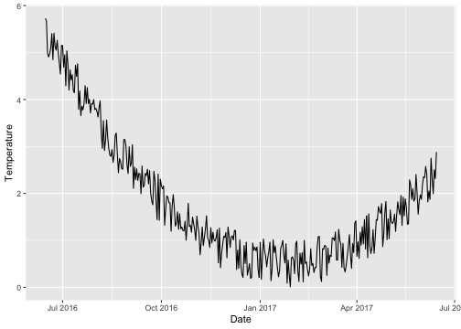
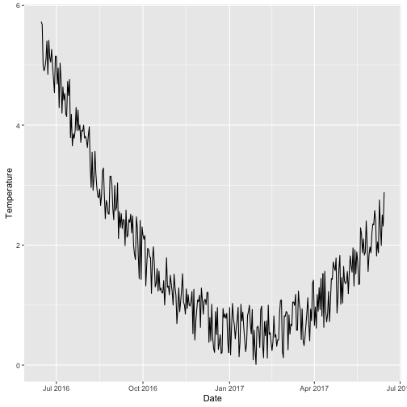
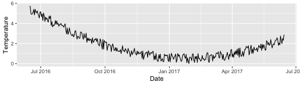

# Introduction

- Position scales: How to place data points in the plot.

<!--To make any sort of data visualization, we need to define position scales, which determine where in a graphic different data values are located. We cannot visualize data
without placing different data points at different locations,-->
  
- Arrangement of axes

     - horozontal x-axis and a vertical y-axis.

     - y-axis run at an acute angle relative to the x-axis.
     
     - one axis run in a circle and the other run radially.

<!--For example, we could have the y axis run at an acute angle relative to the x axis-->
  


## Definiation: coordinate systems

"The combination of a set of position scales and their relative geometric arrangement is called a coordinate system." (Claus O. Wilke)

---

# Cartesian Coordinates

## 2D Cartesian coordinate system

- Two orthogonal axes (horizontal x-axis, vertical y-axis).

<!--The most widely used coordinate system for data visualization is the 2D Cartesian coordinate system.-->

- If X and Y axes are measured in the same units, the grid spacing for the two axes should be equal. The plot area should be a perfect square.

.pull-left[


```r
library(ggplot2)
ggplot(data=iris, 
       aes(x=Sepal.Length, 
           y=Sepal.Width))+
  geom_point()+
*  theme(aspect.ratio = 1)
```
]

.pull-right[
<!-- -->

]

---
# 2D Cartesian coordinate system (cont.)

Cartesian coordinate systems are invariant under linear transformations.

<!-- What happens if you change the units of your data? A change in units is a linear transformation, where we add or substract a number to or from all data values and/or multiply all data values with another number. Cartisian coordinate systems are invariant under such linear transformations. Therefore, you can change the units of your data and the resulting figures will not change as long as you change the axes accordingly.Even though the grid lines are in different
locations and the numbers along the axes are different, the two data visualizations
look exactly the same.-->

.pull-left[

```r
library(ggplot2)
ggplot(data=iris, 
       aes(x=Sepal.Length, 
           y=Sepal.Width))+
  geom_point()+theme(aspect.ratio = 1)
```

<!-- -->
]
.pull-right[

```r
library(ggplot2)
ggplot(data=iris, 
       aes(x=Sepal.Length*100, 
           y=Sepal.Width*100))+
  geom_point()+theme(aspect.ratio = 1)
```

<!-- -->

]

---
# 2D Cartesian coordinate system (cont)

When two different types of variables are mapped to $X$ and $Y$ the plotting area can be stretched or compressed one relative to the other to maintain a valid visualization of the data.

Example: X-Temperature, Y-Date

<!-- -->

---

# 2D Cartesian coordinate system (cont)

.pull-left[

**Square grid**

<!-- -->


]

.pull-right[

**Rectangular grid**




]

---
# Nonlinear Axes


```r
x <- c(1, 3.2, 12, 35, 100, 1000); x
```

```
[1]    1.0    3.2   12.0   35.0  100.0 1000.0
```

```r
log_10_x <- log(x, base=10); log_10_x
```

```
[1] 0.000000 0.505150 1.079181 1.544068 2.000000 3.000000
```

<!-- -->

<!--The first is to respond to skewness towards large values; i.e., cases in which one or a few points are much larger than the bulk of the data-->
---

# Nonlinear Axes (Cont.)

.pull-left[
<!-- -->

]

.pull-right[


<!-- -->
]
- Frist 3 plots are correct. Fourth graph is incorrect.

- No difference between plotting the log-transformed data on a
linear scale or plotting the original data on a logarithmic scale. The only difference lies in labelling values. 

- First two are preferable.

- Third graph: high mental burden when reading the graph.


<!--Mathematically, there is no difference between plotting the log-transformed data on a
linear scale or plotting the original data on a logarithmic scale. The only
difference lies in the labeling for the individual axis ticks and for the axis as a whole. In most cases, the labeling for a logarithmic scale is preferable, because it places less
mental burden on the reader to interpret the numbers shown as the axis tick labels.
There is also less of a risk of confusion about the base of the logarithm. When working
with log-transformed data, we can get confused about whether the data was transformed
using the natural logarithm or the logarithm to base 10. And it’s not
uncommon for labeling to be ambiguous—e.g., log(x), which doesn’t specify a base at
all. I recommend that you always verify the base when working with log-transformed
data. When plotting log-transformed data, always specify the base in the labeling of
the axis.-->
---

# Transformations

Both logarithm sclae and square-root scale compresses larger range into a smaller range.

- Logarithmic scales 

> When the dataset contains wide range of values.


- Square-root scale

> When data contains 0, use square-root transformation.

---

# Logarithmic scales 

Logarithmic scales can emphasize the rate of change in a way that linear scales do not. Italy seems to be slowing the coronavirus infection rate, while the number of cases in Spain continues to double every few days.

.pull-left[
<!-- -->
]


.pull-right[
<!-- -->
]

<!--At a quick glance, the rate of spread in the Spain looks similar to Italy’s, at least when plotted on a linear scale. But on a logarithmic scale, it is instantly apparent that the number of Americans becoming infected continues to double every three days or so. That indicates that the limited measures taken until recently did not sever social contact enough to slow the spreading. The U.S. curve has even bent upward in the last few days — an even faster exponential growth — perhaps reflecting more widespread testing.-->


---

# Coordinate Systems with Curved Axes


We specify positions through **angles** and **radial distance** from the origin.

.pull-left[

**1. Cartesian coordinate system**

<!-- -->

]

.pull-right[

**2. Polar coordinate system**

<!-- -->

]

We have taken the x coordinates from (1) and used them
as angular coordinates and the y coordinates from part (1) and used them as radial
coordinates. The circular axis runs from 0 to 10 in this example, and therefore x = 0 and
x = 10 are the same locations in this coordinate system.
---

## Coordinate Systems with Curved Axes (cont.)


---

## Coordinate Systems with Curved Axes (cont.)

**Monthly anti-diabetic drug sales in Australia from 1991 to 2008.**


```r
autoplot(fpp2::qcement)
```

<!-- -->


---
## Coordinate Systems with Curved Axes (cont.)

### Seasonal plots

- Emphasize seasonal patterns and show changes in these patterns over time.

- Seasonal plot is similar to a time plot except that the data are plotted against the individual “seasons” in which the data were observed. 

- Both plots illustrate a sharp decrease in values in February.

- Notice the colour scale!!!

.pull-left[

<!-- -->

]

.pull-right[

<!-- -->


]

---
## Coordinate Systems with Curved Axes (cont.)

.pull-left[


<!-- --><!-- -->

]

.pull-right[

- Polar coordinates are useful for data of a periodic nature (values at
one end of the scale can be meaningfully joined to data values at the other end).

- The polar version
shows how similar the sales are in December and January. In the Cartesian coordinate system, this fact is
obscured because the values in December and in January are
shown in opposite parts of the graph..
]


<!--A second setting in which we encounter curved axes is in the context of geospatial
data, i.e., maps. Locations on the globe are specified by their longitude and latitude.
But because the earth is a sphere, drawing latitude and longitude as Cartesian axes is
misleading and not recommended (Figure 3-11). -->

---

# Radar chart vs Polar Coordinate

- Polar chart shows values for multiple quantitative variables in the same
display. It uses a radial (circular) layout comprising several equal-angled slices for each variable.

- Radar chart 
