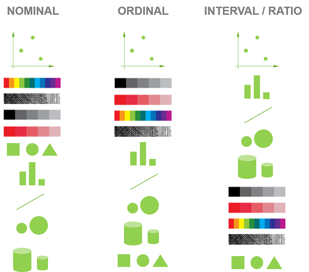

```{r setup, include=FALSE}
options(htmltools.dir.version = FALSE)
```

```{r xaringan-themer, include=FALSE, warning=FALSE}
library(xaringanthemer)
style_mono_accent(
  base_color = "#081d58",
  text_bold_color = "#ce1256",
  title_slide_text_color = "#edf8b1",
  header_font_google = google_font("Josefin Sans"),
  base_font_size = "20px",
  text_font_size = "1.5rem"
 #text_font_google   = google_font("Montserrat", "300", "300i")
 # code_font_google   = google_font("Fira Mono")
)
```


## Cognitive Principles

**Less conginitive effort to read the chart (what is presented) and save the time to think about the content of the chart**

- Good visualizations take advantage of the human visual system's ability to process information with little effort. 

--

## Preattentive graph perception

It requires no conscious effort from the viewer to do understand what is presented through the design. It's automated and takes between 200-500 milliseconds to complete in the spatial memory.

--

(**Spatial** working **memory** entails the ability to keep spatial information active in working memory over a short period of time.)

---

## Preattentive visual properties

1. Color

2. Form: collinearity, curvature, marks, shape, size, spatial grouping, length, width, breadth

3. Spatial position: 2D, 3D

4. Movement: flicker, movement

```{r, comment=NA, echo=FALSE}
library(anicon)
anicon::faa("leaf")
anicon::faa("leaf", animate="bounce")
```


These are processed in our sensory memory without our conscious thoughts (without having knowledge of something).

---
## Inclass discussion


---
class: inverse, center, middle

## Cognitive principles

---
## 1. Proximity

.pull-left[

```{r, comment=NA, echo=FALSE, message=FALSE, warning=FALSE}
library(palmerpenguins)
library(tidyverse)
data(penguins)
penguins[complete.cases(penguins),] %>%
  count(species, sex) %>%
  ggplot(aes(x=sex, y=n, fill=sex)) + 
  geom_bar(stat="identity") + 
  facet_grid(~species) +   scale_fill_manual(values = c("#FB7BBE","#6096FD"))

```
]

.pull-right[

```{r, comment=NA, echo=FALSE, message=FALSE, warning=FALSE}
library(palmerpenguins)
library(tidyverse)
data(penguins)
penguins[complete.cases(penguins),] %>%
  count(species, sex) %>%
  ggplot(aes(x=species, y=n, fill=species)) + 
  geom_bar(stat="identity") + 
  facet_grid(~sex) +   scale_fill_manual(values = c("darkorange","purple","cyan4"))

```

]

---

# 2. Similarity


.pull-left[

```{r, comment=NA, echo=FALSE, message=FALSE, warning=FALSE}
library(palmerpenguins)
library(tidyverse)
data(penguins)
penguins[complete.cases(penguins),] %>%
  count(species, sex) %>%
  ggplot(aes(x=sex, y=n, fill=sex)) + 
  geom_bar(stat="identity") + 
  facet_grid(~species) +   scale_fill_manual(values = c("#FB7BBE","#6096FD"))

```
]

.pull-right[

```{r, comment=NA, echo=FALSE, message=FALSE, warning=FALSE}
library(palmerpenguins)
library(tidyverse)
data(penguins)
penguins[complete.cases(penguins),] %>%
  count(species, sex) %>%
  ggplot(aes(x=species, y=n, fill=species)) + 
  geom_bar(stat="identity") + 
  facet_grid(~sex) +   scale_fill_manual(values = c("darkorange","purple","cyan4"))

```

]

---

## 3. Common region

.pull-left[
```{r, comment=NA, echo=F, warning=FALSE}
ggplot(penguins) + geom_point(aes(x=bill_length_mm, y=bill_depth_mm, color=species)) + scale_color_manual(values = c("darkorange","purple","cyan4"))

```

]

.pull-right[
```{r, comment=NA, echo=F, warning=FALSE}
ggplot(penguins) + geom_point(aes(x=bill_length_mm, y=bill_depth_mm, color=species)) + stat_ellipse(aes(x=bill_length_mm, y=bill_depth_mm, color=species, fill=species), geom="polygon", alpha=0.2)+ scale_color_manual(values = c("darkorange","purple","cyan4")) + 
  scale_fill_manual(values = c("darkorange","purple","cyan4")) 

```

]

---

## 4. Common fate

.pull-left[

```{r, warning=FALSE, comment=NA, message=FALSE, echo=FALSE}

library(coronavirus)
coronavirus %>% filter(country=="US" | country== "India") %>% filter(type=="confirmed") %>%  ggplot() + geom_line(aes(x=date, y=cases, color=country))

```


]

--
.pull-right[

```{r, warning=FALSE, comment=NA, message=FALSE, echo=FALSE}
US <- coronavirus %>% filter(country=="US" | country== "India") %>% filter(type=="confirmed") %>% group_by(country, date) %>%
  summarise(cases = sum(cases)) %>% filter(country=="US")
India <- coronavirus %>% filter(country=="US" | country== "India") %>% filter(type=="confirmed") %>% group_by(country, date) %>%
  summarise(cases = sum(cases)) %>% filter(country=="India")
df <- data.frame(India=India$cases, US=US$cases)
ggplot(df, aes(x=US, y=India)) + geom_point()

```


]

---


.pull-left[

US vs India

```{r, warning=FALSE, comment=NA, message=FALSE, echo=FALSE}

library(coronavirus)
coronavirus %>% filter(country=="US" | country== "India") %>% filter(type=="confirmed") %>%  ggplot() + geom_line(aes(x=date, y=cases, color=country))

```


]

.pull-right[

US vs Russia

```{r, warning=FALSE, comment=NA, message=FALSE, echo=FALSE}
coronavirus %>% filter(country=="US" | country== "Russia") %>% filter(type=="confirmed") %>%  ggplot() + geom_line(aes(x=date, y=cases, color=country))

```

]

---


.pull-left[

US vs India

```{r, warning=FALSE, comment=NA, message=FALSE, echo=FALSE}

US <- coronavirus %>% filter(country=="US" | country== "India") %>% filter(type=="confirmed") %>% group_by(country, date) %>%
  summarise(cases = sum(cases)) %>% filter(country=="US")
India <- coronavirus %>% filter(country=="US" | country== "India") %>% filter(type=="confirmed") %>% group_by(country, date) %>%
  summarise(cases = sum(cases)) %>% filter(country=="India")
df <- data.frame(India=India$cases, US=US$cases)
ggplot(df, aes(x=US, y=India)) + geom_point()


```


]

.pull-right[

US vs Russia

```{r, warning=FALSE, comment=NA, message=FALSE, echo=FALSE}
US<- coronavirus %>% filter(country=="US" | country== "India") %>% filter(type=="confirmed") %>% group_by(country, date) %>%
  summarise(cases = sum(cases)) %>% filter(country=="US")
Russia <- coronavirus %>% filter(country=="Russia" | country== "India") %>% filter(type=="confirmed") %>% group_by(country, date) %>%
  summarise(cases = sum(cases)) %>% filter(country=="Russia")
df <- data.frame(US=US$cases, Russia=Russia$cases)
ggplot(df, aes(x=US, y=Russia)) + geom_point()

```

]

---

## 5. Working memory

More than seven categories decrease readability and increase comprehension time. 

---

## 6. Change blindness

.pull-left[

<iframe width="560" height="800" src="pop.gif" frameborder="0" allow="accelerometer; autoplay; encrypted-media; gyroscope; picture-in-picture" allowfullscreen></iframe>
]

.pull-right[

Resources: https://guyabel.github.io/wcde/articles/wcde.html

]
---

## 7. Easy comparisons

1. Position (common scale)

2. Position (nonaligned scale)

3. Length, direction, angle, slope

4. Area

5. Volume, density, curve

6. Shading, color saturation, colour hue

7. Discriminable shape

8. Indiscriminable shape

---


## 7. Easy comparisons: Example

colour, discriminable shape, indiscriminable shape


```{r, comment=NA, message=FALSE, warning=FALSE, fig.width=20, echo=FALSE}
p1 <- ggplot(penguins) + geom_point(aes(x=bill_length_mm, y=bill_depth_mm, color=species)) + scale_color_manual(values = c("darkorange","purple","cyan4"))
p2 <- ggplot(penguins) + geom_point(aes(x=bill_length_mm, y=bill_depth_mm, shape=species)) + scale_shape_manual(values=LETTERS[c(1, 3, 12)]) 
p3 <- ggplot(penguins) + geom_point(aes(x=bill_length_mm, y=bill_depth_mm, shape=species)) + scale_shape_manual(values=LETTERS[c(5, 6, 12)]) 
library(patchwork)
p1|p2|p3
```


---

## 7. Easy comparisons: Example

.pull-left[

```{r, comment=NA, echo=FALSE, message=FALSE, warning=FALSE}
library(palmerpenguins)
penguins[complete.cases(penguins),] %>%
  count(species, sex) %>%
  ggplot(aes(x=sex, y=n, fill=sex)) + 
  geom_bar(stat="identity") + 
  facet_grid(~species) +   scale_fill_manual(values = c("#FB7BBE","#6096FD"))

```

]

.pull-right[

```{r, comment=NA, echo=FALSE, message=FALSE, warning=FALSE}
p1 <- penguins[complete.cases(penguins),] %>%
  count(species, sex) %>%
  group_by(species) %>%
    mutate(per =  100 *n/sum(n)) %>%
  ggplot(aes(x="", y=n, fill=sex)) + 
  geom_col(stat="identity") + 
  coord_polar("y") + 
   theme(axis.text = element_blank(),
        axis.ticks = element_blank(),
        panel.grid  = element_blank()) +
  facet_grid(~species) +   scale_fill_manual(values = c("#FB7BBE","#6096FD")) + ggtitle("count")

p2 <- penguins[complete.cases(penguins),] %>%
  count(species, sex) %>%
  group_by(species) %>%
    mutate(per =  100 *n/sum(n)) %>%
  ggplot(aes(x="", y=per, fill=sex)) + 
  geom_col(stat="identity") + 
  coord_polar("y") + 
   theme(axis.text = element_blank(),
        axis.ticks = element_blank(),
        panel.grid  = element_blank()) +
  facet_grid(~species) +   scale_fill_manual(values = c("#FB7BBE","#6096FD")) + ggtitle("percentage")

p1/p2

```

]

---

.pull-left[

In 1980s, statisticians William Cleveland and Robert McGill ran some experiments with human volunteers, measuring how accurately they were able to perceive the quantitative information encoded by different cues.


]

.pull-right[

]

---

# Jock D. Mackinlay

Jock D. Mackinlay received his PhD in computer science from Stanford University, where he pioneered the automatic design of graphical presentations of relational information. 

---


## Which visual encoding method is best for you?

.pull-left[

]

.pull-right[

Source: https://www.qlik.com/blog/visual-encoding

]