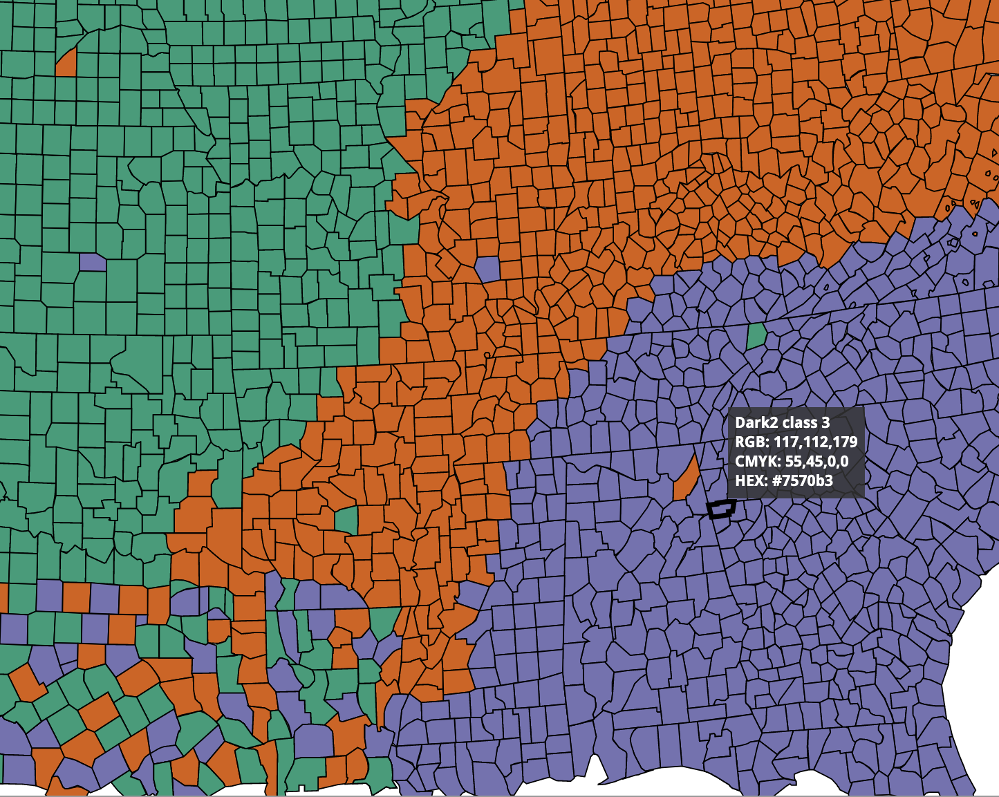
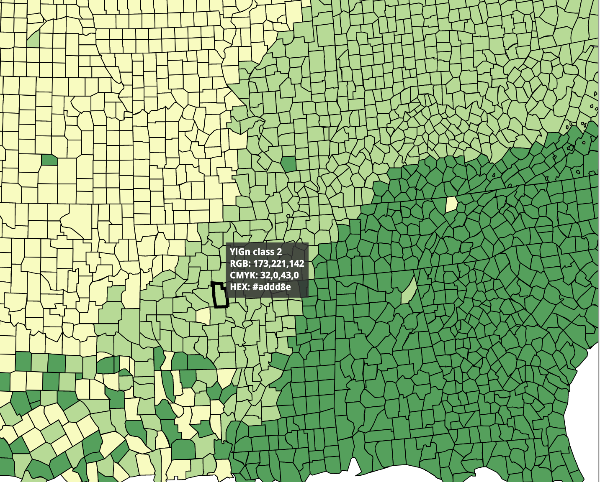
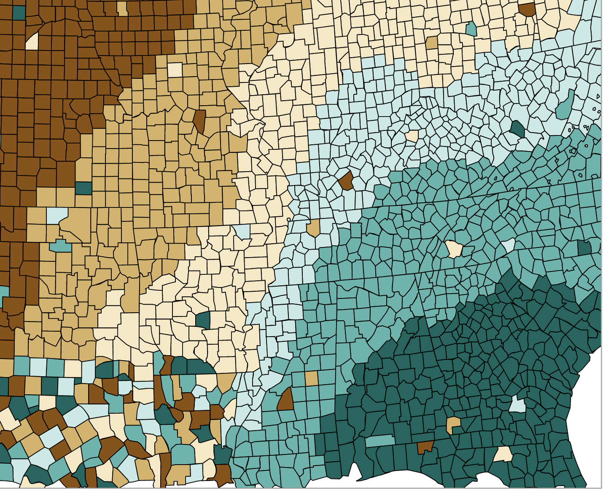
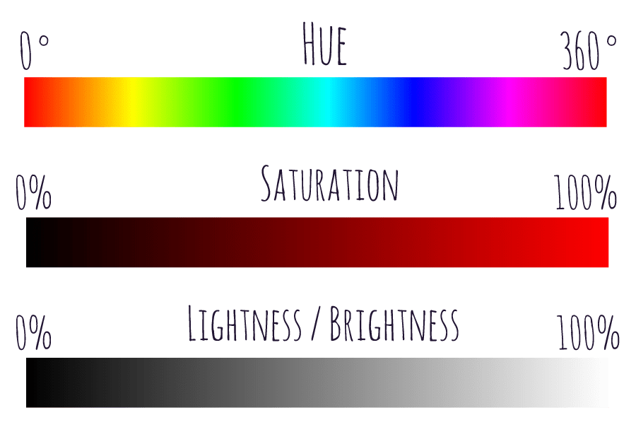

```{r setup, include=FALSE}
options(htmltools.dir.version = FALSE)
```

```{r xaringan-themer, include=FALSE, warning=FALSE}
library(xaringanthemer)
style_mono_accent(
  base_color = "#081d58",
  text_bold_color = "#ce1256",
  title_slide_text_color = "#edf8b1",
  header_font_google = google_font("Josefin Sans"),
  base_font_size = "20px",
  text_font_size = "1.5rem"
 #text_font_google   = google_font("Montserrat", "300", "300i")
 # code_font_google   = google_font("Fira Mono")
)
```


## Color Scales

1. Qualitative color scale

2. Sequential color scale

2. Diverging color scale 

---

# Qualitative color scale



---

# Sequential color scale




---

# Diverging color scale 



---
background-image: url(colours.png)
background-size: contain

---
background-image: url(tt.png)
background-size: contain


<!--https://www.news-medical.net/health/Classification-of-Color-Blindness-Deficiencies.aspx-->

---
class: inverse, center, middle

# Setting colours in ggplot


---

```{r, comment=NA}
library(ggplot2)
ggplot(iris, aes(x=Sepal.Length, y=Sepal.Width)) + geom_point()

```


---

```{r, comment=NA}
library(ggplot2)
ggplot(iris, aes(x=Sepal.Length, y=Sepal.Width)) + geom_point(color="purple")

```

---


```{r, comment=NA}
library(ggplot2)
ggplot(iris, aes(x=Sepal.Length, y=Sepal.Width, color=Species)) + geom_point()

```

---


```{r, comment=NA}
library(ggplot2)
ggplot(iris, aes(x=Sepal.Length, y=Sepal.Width, color=Petal.Length < 5)) + geom_point()

```

---

```{r}
cols <- c("setosa" = "red", "versicolor" = "blue", "virginica" = "darkgreen")
ggplot(iris, aes(x = Sepal.Length, y = Sepal.Width, color = Species)) +
  geom_point( ) + scale_colour_manual(values = cols)
```

---

.pull-left[


]


.pull-right[

```r
RColorBrewer::display.brewer.all()
```

- seq (sequential)

- div (diverging)

- qual (qualitative)

]

---


```{r}
cols <- c("setosa" = "red", "versicolor" = "blue", "virginica" = "darkgreen")
ggplot(iris, aes(x = Sepal.Length, y = Sepal.Width, color = Species)) +
  geom_point( ) + scale_color_brewer(type = 'qual', palette =  'Dark2')
```

---
background-image:url(brew.png)
background-size: contain
---
```{r}
ggplot(iris, aes(x = Sepal.Length, y = Sepal.Width, color = Species)) +
  geom_point( ) + scale_color_manual(values = c("#1b9e77", "#d95f02", "#7570b3"))
```


---

# Viridis colour scales from viridisLite

"The viridis scales provide colour maps that are perceptually uniform in both colour and black-and-white. They are also designed to be perceived by viewers with common forms of colour blindness. See also https://bids.github.io/colormap/."

source: https://ggplot2.tidyverse.org/reference/scale_viridis.html


---

```{r}
ggplot(iris, aes(x = Sepal.Length, y = Sepal.Width, color = Species)) +
  geom_point( ) +  scale_colour_viridis_d()
```

---

```{r}
ggplot(iris, aes(x = Sepal.Length, y = Sepal.Width, color = Species)) +
  geom_point( ) +  scale_colour_viridis_d(option = "plasma")
```

---


```{r}
ggplot(iris, aes(x = Sepal.Length, y = Sepal.Width, color = Species)) +
  geom_point( ) +  scale_colour_viridis_d(option = "inferno")
```


---

```{r, fig.height=4, fig.width=5}
ggplot(iris) +
  geom_point(aes(x = Sepal.Length,
                 y = Sepal.Width,
                 color = Species,
                 shape = Species,
                 alpha = Species)) +
  scale_x_continuous( breaks = c(170,200,230)) +
  scale_y_log10() +
  scale_colour_viridis_d() +
  scale_shape_manual( values = c(17,18,19)) +
  scale_alpha_manual( values = c( "setosa" = 0.6, "versicolor" = 0.5, #
                                  "virginica" = 0.7))

```

---

## Highlight data points

https://thiyanga.netlify.app/post/scatterplot/

---


---

## HSL colour attributes

.pull-left[


]

.pull-right[
Hue: true colours without tint or shades

Saturation: light tints to dark shades 

Lightness (Value)

]

image source: https://purple11.com/basics/hue-saturation-lightness/

---
class: inverse, middle, center

# Coordinates


---

```{r, comment=NA}
library(palmerpenguins)
data(penguins)
ggplot(penguins) +
  geom_bar(aes(x= species, fill = species))
```

---

```{r, comment=NA}
ggplot(penguins) +
  geom_bar(aes(x= species, fill = species)) + coord_flip()
```

---
.pull-left[
```{r, fig.height=5}
ggplot(penguins) +
  geom_bar(aes(x= year, fill = species))
```

]

---

.pull-left[
```{r, fig.height=5}
## Zooming into a plot with scale
ggplot(penguins) +
  geom_bar(aes(x= year, fill = species)) +
  scale_y_continuous(limits = c(0,115))
```

]

.pull-right[

When zooming with scale, any data outside the limits is thrown away
]

---

## Zooming into a plot with scale

.pull-left[
```{r, fig.height=5}
ggplot(penguins) +
  geom_bar(aes(x= year, fill = species)) +
  coord_cartesian(ylim = c(0,115))
```

]

.pull-right[

Proper zoom with `coord_cartesian()`
]


---
.pull-left[
```{r, fig.height=5}
p <- ggplot(mtcars, aes(disp, wt)) + geom_point() + geom_smooth()
p
```

]

.pull-right[
```{r, fig.height=5}
# Setting the limits on a scale converts all values outside the range to NA.
p + scale_x_continuous(limits = c(325, 500))
```

]

---

.pull-left[
```{r, fig.height=5}
p <- ggplot(mtcars, aes(disp, wt)) + geom_point() + geom_smooth()
p
```

]

.pull-right[
```{r, fig.height=5}
# Setting the limits on the coordinate system performs a visual zoom.
# The data is unchanged, and we just view a small portion of the original
# plot. Note how smooth continues past the points visible on this plot.
p + coord_cartesian(xlim = c(325, 500))
```

]

---

```{r}
ggplot(iris, aes(y=Sepal.Length, x=Sepal.Width)) + geom_point()

```

---

```{r}
ggplot(iris, aes(y=Sepal.Length, x=Sepal.Width)) + geom_point() + coord_fixed(ratio = 1)

```

---

```{r}
ggplot(iris, aes(y=Sepal.Length, x=Sepal.Width)) + geom_point() + coord_fixed(ratio = 0.5)

```

---

```{r}
ggplot(iris, aes(y=Sepal.Length, x=Sepal.Width)) + geom_point() + coord_fixed(ratio = 5)

```

---

```{r}
ggplot(iris, aes(y=Sepal.Length, x=Sepal.Width)) + geom_point() + coord_fixed(ratio = 1/5)

```

---

```{r}
ggplot(iris, aes(y=Sepal.Length, x=Sepal.Width)) + geom_point() + coord_fixed(ylim = c(0, 6))

```