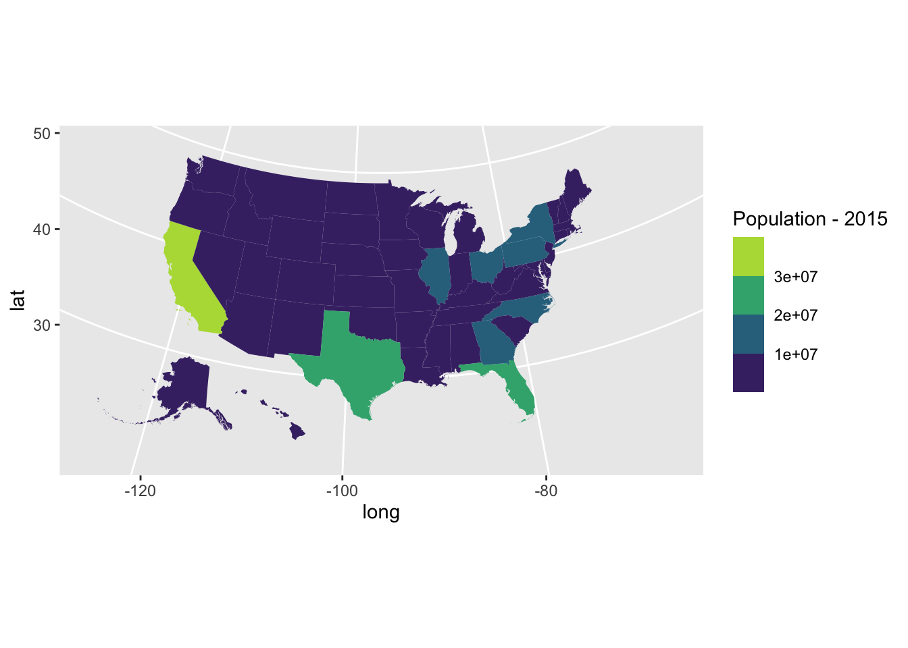

## Packages


```r
# devtools::install_github("UrbanInstitute/urbnmapr")
library(tidyverse)
library(magrittr)
library(urbnmapr)
library(usmap) # to obtain population data
library(ggthemes)
library(scales)
library(geofacet)
```

## Data


```r
head(states)
```

```
# A tibble: 6 x 9
   long   lat order hole  piece group state_fips state_abbv state_name
  <dbl> <dbl> <int> <lgl> <fct> <fct> <chr>      <chr>      <chr>     
1 -88.5  31.9     1 FALSE 1     01.1  01         AL         Alabama   
2 -88.5  31.9     2 FALSE 1     01.1  01         AL         Alabama   
3 -88.5  31.9     3 FALSE 1     01.1  01         AL         Alabama   
4 -88.5  32.0     4 FALSE 1     01.1  01         AL         Alabama   
5 -88.5  32.0     5 FALSE 1     01.1  01         AL         Alabama   
6 -88.5  32.1     6 FALSE 1     01.1  01         AL         Alabama   
```

```r
head(statepop)
```

```
# A tibble: 6 x 4
  fips  abbr  full       pop_2015
  <chr> <chr> <chr>         <dbl>
1 01    AL    Alabama     4858979
2 02    AK    Alaska       738432
3 04    AZ    Arizona     6828065
4 05    AR    Arkansas    2978204
5 06    CA    California 39144818
6 08    CO    Colorado    5456574
```

Combine data


```r
statepop1 <- statepop %>% rename(state_name = full)
head(statepop1)
```

```
# A tibble: 6 x 4
  fips  abbr  state_name pop_2015
  <chr> <chr> <chr>         <dbl>
1 01    AL    Alabama     4858979
2 02    AK    Alaska       738432
3 04    AZ    Arizona     6828065
4 05    AR    Arkansas    2978204
5 06    CA    California 39144818
6 08    CO    Colorado    5456574
```

```r
statepop2 <- full_join(statepop1, states, by = "state_name")
head(statepop2)
```

```
# A tibble: 6 x 12
  fips  abbr  state_name pop_2015  long   lat order hole  piece group state_fips
  <chr> <chr> <chr>         <dbl> <dbl> <dbl> <int> <lgl> <fct> <fct> <chr>     
1 01    AL    Alabama     4858979 -88.5  31.9     1 FALSE 1     01.1  01        
2 01    AL    Alabama     4858979 -88.5  31.9     2 FALSE 1     01.1  01        
3 01    AL    Alabama     4858979 -88.5  31.9     3 FALSE 1     01.1  01        
4 01    AL    Alabama     4858979 -88.5  32.0     4 FALSE 1     01.1  01        
5 01    AL    Alabama     4858979 -88.5  32.0     5 FALSE 1     01.1  01        
6 01    AL    Alabama     4858979 -88.5  32.1     6 FALSE 1     01.1  01        
# … with 1 more variable: state_abbv <chr>
```


## Choropleth Map

Divides geographical areas or regions that are coloured, sheaded or patterned in relation to a variable.

Cons: 

- Difficult to read actual values

- Larger regions appear more emphasisted than smaller ones. This can be avoided by using bubble maps.


**1. Shape files**


```r
ggplot() + 
  geom_polygon(data = statepop2, mapping = aes(x = long, y = lat, group = group),fill = "grey", color = "white") +
  coord_map(projection = "albers", lat0 = 39, lat1 = 45)
```


```r
ggplot() +
  geom_polygon(data = statepop2, aes( x = long, y = lat, group = group, fill = pop_2015), color="white") +
  theme_void() +
  coord_map()
```


```r
statepop2 %>%
  ggplot(aes(long, lat, group = group, fill = pop_2015)) +
  geom_polygon(color = NA) +
  coord_map(projection = "albers", lat0 = 39, lat1 = 45) +
  labs(fill = "Population - 2015")
```


```r
statepop2 %>%
  ggplot(aes(long, lat, group = group, fill = pop_2015)) +
  geom_polygon(color = NA) +
  coord_map(projection = "albers", lat0 = 39, lat1 = 45) +
  labs(fill = "Population - 2015") + scale_fill_viridis_b()
```



`projection = "bonne"`


```r
statepop2 %>%
  ggplot(aes(long, lat, group = group, fill = pop_2015)) +
  geom_polygon(color = NA) +
  coord_map(projection = "bonne", parameters  = 45) +
  labs(fill = "Population - 2015") + scale_fill_viridis_b() +
  ggthemes::theme_map()
```


This map implies that most state populations are small. Showing population ranks, or percentile values, can help see the variation a bit clearer.


```r
statepop2 <- mutate(statepop2, rank_pop_2015 = rank(pop_2015))
statepop2 %>%
  ggplot(aes(long, lat, group = group, fill = rank_pop_2015)) +
  geom_polygon(color = NA) +
  coord_map(projection = "bonne", parameters  = 45) +
  labs(fill = "Population - 2015") + scale_fill_viridis_b() +
  ggthemes::theme_map()
```


```r
statepop2 <- mutate(statepop2 ,
              pcls = cut(pop_2015, quantile(pop_2015, seq(0, 1, len = 6)),
                         include.lowest = TRUE))
statepop2 %>%
  ggplot(aes(long, lat, group = group, fill = pcls)) +
  geom_polygon(color = NA) +
  coord_map(projection = "bonne", parameters  = 45) +
  labs(fill = "Population - 2015") + scale_fill_brewer(palette = "Spectral") +
  ggthemes::theme_map()
```


In the above graphs colour ordering is difficult to map with numbers.


```r
statepop2 %>%
  ggplot(aes(long, lat, group = group, fill = pcls)) +
  geom_polygon(color = NA) +
  coord_map(projection = "bonne", parameters  = 45) +
  labs(fill = "Population - 2015") + scale_fill_brewer(palette = "Reds") +
  ggthemes::theme_map()
```


## Choropleth Maps of Median Household Income by Subregions


```r
head(countydata)
```

```
# A tibble: 6 x 5
   year county_fips  hhpop horate medhhincome
  <int> <chr>        <dbl>  <dbl>       <int>
1  2015 01001       20237.  0.746       52200
2  2015 01003       72269   0.733       53600
3  2015 01005       10287.  0.587       32400
4  2015 01007        8198.  0.687       26000
5  2015 01009       21094.  0.832       53000
6  2015 01011        4104.  0.587       32400
```

```r
head(counties)
```

```
# A tibble: 6 x 12
   long   lat order hole  piece group county_fips state_abbv state_fips
  <dbl> <dbl> <int> <lgl> <fct> <fct> <chr>       <chr>      <chr>     
1 -86.9  32.7     1 FALSE 1     0100… 01001       AL         01        
2 -86.8  32.7     2 FALSE 1     0100… 01001       AL         01        
3 -86.7  32.7     3 FALSE 1     0100… 01001       AL         01        
4 -86.7  32.7     4 FALSE 1     0100… 01001       AL         01        
5 -86.4  32.7     5 FALSE 1     0100… 01001       AL         01        
6 -86.4  32.4     6 FALSE 1     0100… 01001       AL         01        
# … with 3 more variables: county_name <chr>, fips_class <chr>,
#   state_name <chr>
```

```r
household_data <- left_join(countydata, counties, by = "county_fips") 

household_data %>%
  ggplot(aes(long, lat, group = group, fill = medhhincome)) +
  geom_polygon(color = NA) +
  coord_map(projection = "albers", lat0 = 39, lat1 = 45) +
  labs(fill = "Median Household Income") + scale_fill_viridis_b()
```


## Choropleth Maps of Household ownership by Subregions


```r
household_data %>%
  ggplot(aes(long, lat, group = group, fill = horate)) +
  geom_polygon(color = NA) +
 scale_fill_viridis_c()
```


Now we add a layer to the previous graph.


```r
household_data %>%
  ggplot(aes(long, lat, group = group, fill = horate)) +
  geom_polygon(color = NA) +
  geom_polygon(data = states, mapping = aes(long, lat, group = group),
               fill = NA, color = "#ffffff") +
  coord_map(projection = "albers", lat0 = 39, lat1 = 45) +
  theme(legend.title = element_text(),
        legend.key.width = unit(.5, "in")) +
  labs(fill = "Homeownership rate") + scale_fill_viridis_c()
```


Using a simple diverging palette


```r
household_data %>%
  ggplot(aes(long, lat, group = group, fill = horate)) +
  geom_polygon(color = NA) +
  geom_polygon(data = states, mapping = aes(long, lat, group = group),
               fill = NA, color = "#ffffff") +
  coord_map(projection = "albers", lat0 = 39, lat1 = 45) +
  theme(legend.title = element_text(),
        legend.key.width = unit(.5, "in")) +
  labs(fill = "Homeownership rate") + scale_fill_gradient2()
```


## Bubble maps

Cons: Overlapping bubble. 


```r
state_centroids <- summarize(group_by(counties, state_fips), x = mean(range(long)), y = mean(range(lat)))
head(state_centroids)
```

```
# A tibble: 6 x 3
  state_fips      x     y
  <chr>       <dbl> <dbl>
1 01          -86.7  32.6
2 02         -118.   25.8
3 04         -112.   34.2
4 05          -92.1  34.8
5 06         -119.   37.3
6 08         -106.   39.0
```

```r
state_centroids <- state_centroids %>% rename(fips=state_fips)
state_pops <- select(statepop2, pop = pop_2015, fips)
state_pops <- inner_join(state_pops, state_centroids, "fips")
```


```r
household_data %>%
  ggplot() +
    geom_polygon(aes(long, lat, group = group), fill = NA, col = "grey") +
    geom_point(aes(x, y, size = pop), data = state_pops) + scale_size_area() +
    coord_map("bonne", parameters=45) + ggthemes::theme_map() + ggtitle("State population")
```


```r
county_centroids <- summarize(group_by(household_data, county_fips), x = mean(range(long)), y = mean(range(lat)))
head(county_centroids)
```

```
# A tibble: 6 x 3
  county_fips     x     y
  <chr>       <dbl> <dbl>
1 01001       -86.7  32.5
2 01003       -87.7  30.8
3 01005       -85.4  31.9
4 01007       -87.1  33.0
5 01009       -86.6  34.0
6 01011       -85.7  32.1
```

```r
county_income <- select(household_data, income = medhhincome, county_fips)
county_income <- inner_join(county_income, county_centroids, "county_fips")
head(county_income)
```

```
# A tibble: 6 x 4
  income county_fips     x     y
   <int> <chr>       <dbl> <dbl>
1  52200 01001       -86.7  32.5
2  52200 01001       -86.7  32.5
3  52200 01001       -86.7  32.5
4  52200 01001       -86.7  32.5
5  52200 01001       -86.7  32.5
6  52200 01001       -86.7  32.5
```


```r
household_data %>%
  ggplot() +
    geom_polygon(aes(long, lat, group = group), fill = NA, col = "grey") +
    geom_point(aes(x, y, colour = income), data = county_income, alpha=0.5, size=0.2) + scale_size_area() +
    coord_map("bonne", parameters=45) + ggthemes::theme_map() 
```


## Connecting map, Link map, Ray map

Useful for visualizing map routes.

## Contemporary alternatives to Choropleth maps

### Cartograms

A cartogram is a map in which the geometry of regions is distorted in order to convey the information of an alternate variable. 

> "Instead of using color to encode the values of the data, cartograms use size. Cartograms elarge or shrink a geographic entity based on the size of the related values of the variable being visualized" (Ryan Hafen).

Since the shapes are arbitrary, it is hard for the human to make comparisons of size based on the shapes.

<!--https://ryanhafen.com/blog/geofacet/-->

#### Contiguous cartogram


```r
library(cartogram)
library(tmap)
library(maptools)
library(rgdal)
#> Loading required package: sp
#> Checking rgeos availability: TRUE

data(wrld_simpl)

# keep only the african continent
afr <- wrld_simpl[wrld_simpl$REGION == 2, ]

# project the map
afr <- spTransform(afr, CRS("+init=epsg:3395"))

# construct cartogram
afr_cont <- cartogram_cont(afr, "POP2005", itermax = 5)
#> Warning in CPL_crs_from_proj4string(x): GDAL Message 1: +init=epsg:XXXX syntax
#> is deprecated. It might return a CRS with a non-EPSG compliant axis order.
#> Mean size error for iteration 1: 5.79457153280442
#> Mean size error for iteration 2: 4.94825547349441
#> Mean size error for iteration 3: 4.32626995057149
#> Mean size error for iteration 4: 3.84940324694301
#> Mean size error for iteration 5: 3.45917774259599

# plot it
tm_shape(afr_cont) + tm_polygons("POP2005", style = "jenks") +
  tm_layout(frame = FALSE, legend.position = c("left", "bottom"))
```


#### Non-contiguous, shape-preserved cartogram


```r
# construct cartogram
afr_ncont <- cartogram_ncont(afr, "POP2005")

# plot it
tm_shape(afr) + tm_borders() +
  tm_shape(afr_ncont) + tm_polygons("POP2005", style = "jenks") +
  tm_layout(frame = FALSE, legend.position = c("left", "bottom"))
```


#### Dorling cartogram (non-contiguous)

Non-overlapping Circles Cartogram


```r
# construct cartogram
afr_dorling <- cartogram_dorling(afr, "POP2005")

# plot it
tm_shape(afr) + tm_borders() +
  tm_shape(afr_dorling) + tm_polygons("POP2005", style = "jenks") +
  tm_layout(frame = FALSE, legend.position = c("left", "bottom"))
```


#### Tile map (non-contiguous)


```r
library(statebins)
library(viridis)

data(USArrests)

# make up some data for the example

rownames_to_column(USArrests, "state") %>%
  bind_rows(
    data_frame(
      state = c("Virgin Islands", "Puerto Rico", "New York City"),
      Murder = rep(mean(max(USArrests$Murder),3)),
      Assault = rep(mean(max(USArrests$Assault),3)),
      Rape = rep(mean(max(USArrests$Rape),3)),
      UrbanPop = c(93, 95, 100)
    )
  ) -> us_arrests

statebins(us_arrests, value_col="Assault",
          ggplot2_scale_function = viridis::scale_fill_viridis) +
  labs(title="USArrests + made up data") +
  theme_statebins("right")
```


## Geofacet

**Ranking of U.S. states in six quality-of-life categories, where a state with a rank of 1 is doing the best in the category and a rank of 51 is the worst.**


```r
library(geofacet)
library(ggplot2)

ggplot(state_ranks, aes(variable, rank, fill = variable)) +
  geom_col() +
  coord_flip() +
  theme_bw() +
  facet_geo(~ state, grid = "us_state_grid2")
```


## Small-multiple maps

Spatioal data over time


```r
library(plotly)
library(dplyr)
df <- read.csv('https://raw.githubusercontent.com/plotly/datasets/master/1962_2006_walmart_store_openings.csv')

# common map properties
g <- list(
  scope = 'usa',
  showland = T,
  landcolor = toRGB("gray90"),
  showcountries = F,
  subunitcolor = toRGB("white")
)

one_map <- function(dat) {
  plot_geo(dat) %>%
    add_markers(x = ~LON, y = ~LAT, color = I("blue"), alpha = 0.5) %>%
    add_text(x = -78, y = 47, text = ~unique(YEAR), color = I("black")) %>%
    layout(geo = g)}

df <- df %>% group_by(YEAR)
df <- df %>% do(mafig = one_map(.))
fig <- df %>% subplot(nrows = 9)
fig <- fig %>% layout(
  showlegend = FALSE,
  title = 'New Walmart Stores per year 1962-2006<br> Source: <a href="http://www.econ.umn.edu/~holmes/data/WalMart/index.html">University of Minnesota</a>',
  width = 1000,
  height = 900,
  hovermode = FALSE
)

fig
```

preserve6468b7eb7293b961


## Reading 

[Here](https://ryanhafen.com/blog/geofacet/)

[Here](https://bytefish.de/blog/choropleth_maps_in_r/)

## Acknowledgement

https://github.com/sjewo/cartogram

https://plotly.com/r/map-subplots-and-small-multiples/
