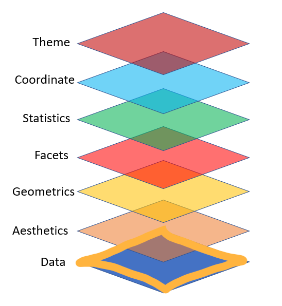

```{r setup, include=FALSE}
options(htmltools.dir.version = FALSE)
```
class: center, middle

# Grammar of graphics

Mapping data to **aesthetic** attributes (colour, shape, size) of **geometric** objects (points, lines, bars).

---

## Elements of ggplot2 object

- Data: data to be plotted

- Aes: mapping between variables to their visualization

- Geoms: objects/shapes you add as layers to the graph (How the plot will work?)

- Stats: statistical transformations when you are not plotting the raw data

- Faceting: multiple panels

---

### Layer grammatical elements


---
## Making your first plot with ggplot

```{r, comment=NA, fig.height=6}
library(ggplot2)
ggplot()

```

---

## Making your first plot with ggplot

- Data

```{r, comment=NA, fig.height=6}
ggplot(iris)
```

---

## Making your first plot with ggplot

- Data + Aes

```{r, comment=NA, fig.height=6}
ggplot(iris, aes(x = Sepal.Length, y = Sepal.Width)) 
```

---

## Making your first plot with ggplot

- Data + Aes + Geom

```{r, comment=NA, fig.height=6}
ggplot(iris, aes(x = Sepal.Length, y = Sepal.Width)) + geom_point()
```

---

## Making your first plot with ggplot

- Data + Aes + Geom + Facets

```{r, comment=NA, fig.height=6}
ggplot(iris, aes(x = Sepal.Length, y = Sepal.Width)) + geom_point() + facet_grid(. ~ Species)
```

---

## Making your first plot with ggplot

- Data + Aes + Geom + Facets + Statistics

```{r, comment=NA, fig.height=5}
ggplot(iris, aes(x = Sepal.Length, y = Sepal.Width)) +
  geom_point() +
  facet_grid(. ~ Species) +
  stat_smooth(method = "lm", se=F, col="red")
  
```

---
## Making your first plot with ggplot

- Data + Aes + Geom + Facets + Statistics + Coordinates

```{r, comment=NA, warning=FALSE, message=FALSE, fig.height=6}
ggplot(iris, aes(x = Sepal.Length, y = Sepal.Width)) +
  geom_point() +
  facet_grid(. ~ Species) +
  stat_smooth(method = "lm", se=F, col="red") + 
  scale_y_continuous("Sepal Width (cm)")+
  scale_x_continuous("Sepal Width (cm)")+
  coord_equal()
```

---

## Making your first plot with ggplot

- Data + Aes + Geom + Facets + Statistics + Coordinates + Theme

```{r, comment=NA, warning=FALSE, message=FALSE, fig.height=5}
ggplot(iris, aes(x = Sepal.Length, y = Sepal.Width)) +
  geom_point() +
  facet_grid(. ~ Species) +
  stat_smooth(method = "lm", se=F, col="red") + 
  scale_y_continuous("Sepal Width (cm)")+
  scale_x_continuous("Sepal Width (cm)")+
  coord_equal()+
  theme(panel.background = element_blank())
```
