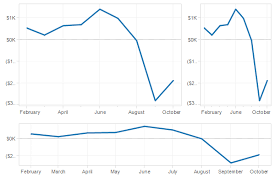
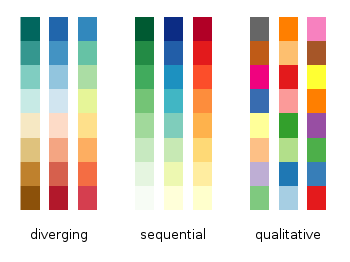

```{r setup, include=FALSE}
options(htmltools.dir.version = FALSE)
```

# Guidelines for effective data visualization

Encoding: translating the data into a visual element on a chart/map/etc.


---
# Encoding vs Decoding


Read [here](https://eagereyes.org/basics/encoding-vs-decoding)

---
## 1. Simplicity

- Color

- Increment: Use increments like (0, 2, 4, 6,..) instead of , say (0, 3, 6, 9,...)

- Scale: Don't plot two unrelated series with one scale on left and one on the right

- Style: Flat and simple. No 3D effects, shadows, distracting shadings

- Set the baseline to zero


              
---

## 2. Type of encoding object and attribute used to create a plot

- Encoding objects: points, lines, bars

- Value-encoding attributes [to show different pieces of information]: point position, line length, color

- everyone has different perceptions of visualizations but there are a few simple steps that everyone can follow.


.footer-note[.tiny[.green[Image Credit: ][Patrik Lundblad ](https://blog.qlik.com/visual-encoding)]]

---

## Which visual encoding method is best for you?


.footer-note[.tiny[.green[Image Credit: ][Patrik Lundblad ](https://blog.qlik.com/visual-encoding)]]

---
## Inappropriate encoding


.footer-note[.tiny[.green[Image Credit: ][Patrik Lundblad ](https://blog.qlik.com/visual-encoding)]]
---
## Appropriate encoding


.footer-note[.tiny[.green[Image Credit: ][Patrik Lundblad ](https://blog.qlik.com/visual-encoding)]]

---

## Select meaningful axis ranges

- When absolute magnitudes are important, the vertical axis should begin at zero.


---

## Data transformation 

- plotting on a logarithmic vertical axis can remove skewness in datasets with ranges that include very large and small values (Cleveland, 1994)


---

## Graph aspect ratio

- ratio of a graph's height to width


---
## Plot overlapping points in a way that density differences become clear in scatter plots

### Method 1

```{r, comment=NA, echo=FALSE, fig.width=10, fig.height=10}
library(ggplot2)
library(patchwork)
a1 <- ggplot(diamonds, aes(x = carat, y = price)) +
    geom_point()  + theme(aspect.ratio = 1)  
a2 <- ggplot(diamonds, aes(x = carat, y = price)) +
geom_point(alpha = 0.05)  + theme(aspect.ratio = 1)  
a1|a2

```

---

## Plot overlapping points in a way that density differences become clear in scatter plots

### Method 2


---

## Use lines when connecting sequential data in time-series plot

---

## Aggregate larger datasets in meaningful ways

- Large quantitative dataset : box-and-whisker plots or through kernel smoothing strategies

- Combination of quantitative and categorical: dotplots, or linked micromap plots

- Pie charts should be avoided: difficult to perceive differences in angles

- long time series: temporal aggregation, averaging values across a large time step ( eg: daily to monthly)

---


---

## Maintain similar vertical or horizontal axis ranges across subplots


---

## Select an appropriate colour scheme




