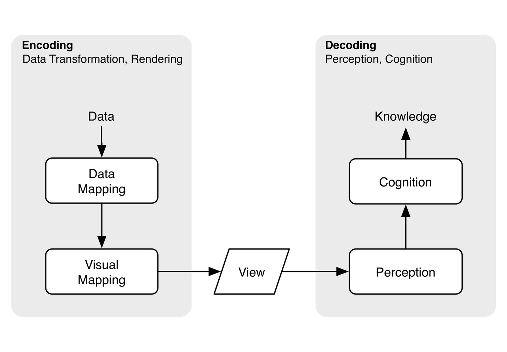

```{r setup, include=FALSE}
options(htmltools.dir.version = FALSE)
```

```{r xaringan-themer, include=FALSE, warning=FALSE}
library(xaringanthemer)
style_mono_accent(
  base_color = "#081d58",
  text_bold_color = "#ce1256",
  title_slide_text_color = "#edf8b1",
  header_font_google = google_font("Josefin Sans"),
  base_font_size = "20px",
  text_font_size = "1.5rem"
 #text_font_google   = google_font("Montserrat", "300", "300i")
 # code_font_google   = google_font("Fira Mono")
)
```


## Encoding data using visual cues

Encoding: Mapping the data into a visual element (visual cues) on a chart/map/etc.

.pull-left[
```{r, comment=NA, fig.cap="Stuart Hall’s 1973 “Encoding/Decoding” model.", echo=FALSE}

knitr::include_graphics("encoding.png")
```


]

.pull-right[

**Encoding:** the creation of a messages

**Decoding:** carefully read and listen the message for better understanding (interprets, the message for themselves.)
]

.footnote[[Image source: https://towardsdatascience.com/]]
---

# Encoding vs Decoding

```{r, comment=NA, fig.cap="Image source: https://eagereyes.org/basics/encoding-vs-decoding” ", echo=FALSE, out.width="50%", fig.align = 'center'}


```


<!--Read [here](https://eagereyes.org/basics/encoding-vs-decoding)-->

---
background-image: url(ass1.png) 
background-position: center 
background-size: contain

---

background-image: url(ass2.png) 
background-position: center 
background-size: contain

---
background-image: url(ass3.png) 
background-position: center 
background-size: contain

---

background-image: url(ass4.png) 
background-position: center 
background-size: contain

---

background-image: url(ass5.png) 
background-position: center 
background-size: contain

---

background-image: url(ass6.png) 
background-position: center 
background-size: contain

---

background-image: url(ass7.png) 
background-position: center 
background-size: contain

---

## Simplicity

- Colour

- Increment: Use increments like (0, 2, 4, 6,..) instead of , say (0, 3, 6, 9,...)

- Scale: Don't plot two unrelated series with one scale on left and one on the right.

- Style: Flat and simple. No 3D effects, shadows, distracting shadings.

- Set the baseline to zero.


