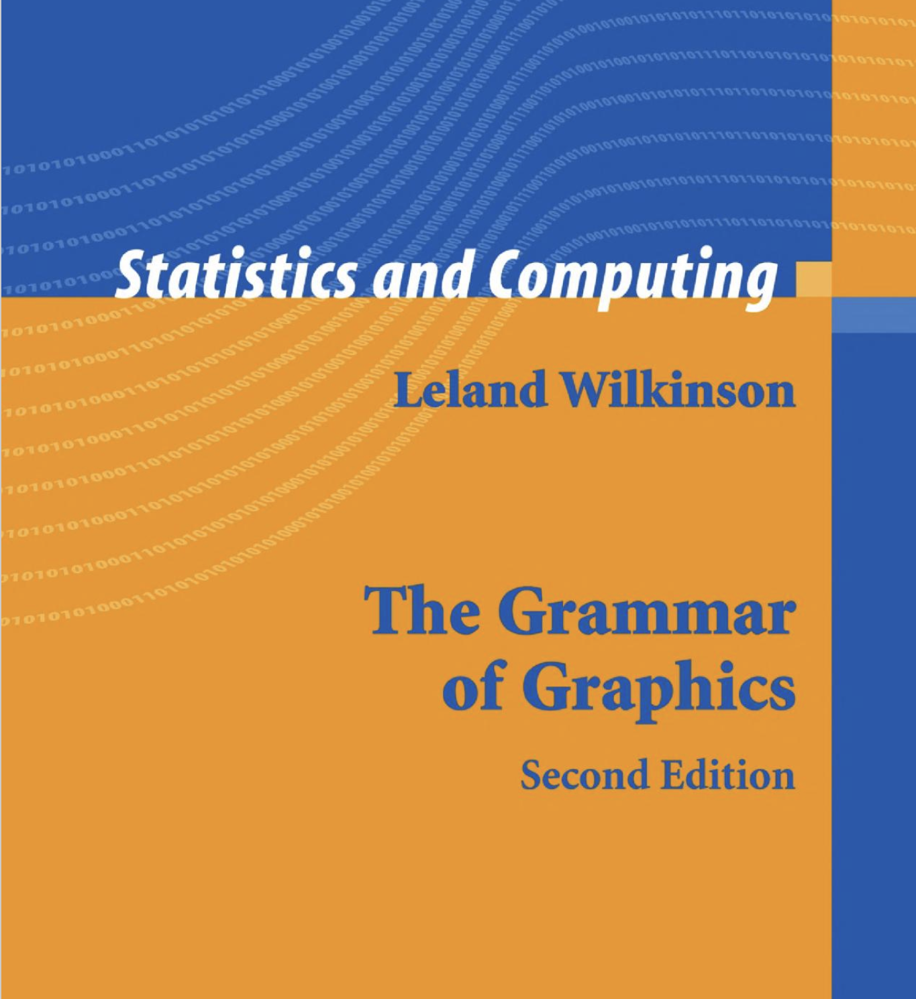

```{r setup, include=FALSE}
options(htmltools.dir.version = FALSE)
```

# Plotting with R

## Base R

- using `plot()` function

## Using ggplot2: grammar of graphics

1.  ggplot2 package: `qplot()` function

    - **q**plot: **quick** plot
    
    - very similar to how you graph with `plot()` function

2. ggplot2 package: `ggplot()` function

    - fully utilize the power of grammar

---
`diamonds` data set

```{r, comment=NA}
library(ggplot2)
data(diamonds)
head(diamonds)
tail(diamonds)
```

---

### Base R: Bar chart

```{r, fig.height=4}
color.summary <- table(diamonds$color); color.summary
barplot(color.summary, xlab="color", ylab = "counts")
```


---

### Base R: Percentage bar chart

```{r, fig.height=4}
color.percent <- table(diamonds$color)/length(diamonds$color)*100; color.percent
barplot(color.percent, xlab="color", ylab = "%")
```


---

### Base R: Percentage bar chart

```{r, fig.height=4}
twoway.table <- table(diamonds$color, diamonds$cut); twoway.table
barplot(twoway.table, xlab="color", ylab = "%", legend=rownames(twoway.table))
```

---

## Base R: Stacked bar chart

```{r, fig.height=4}
twoway.table <- table(diamonds$color, diamonds$cut); twoway.table
barplot(twoway.table, xlab="color", ylab = "%", col=c("red", "blue", "green", "orange", "yellow", "black", "pink"), legend=rownames(twoway.table), args.legend = list(x = "topleft"), beside = FALSE)
```


---

## Base R: Cluster bar chart

```{r, fig.height=4}
twoway.table <- table(diamonds$color, diamonds$cut); twoway.table
barplot(twoway.table, xlab="color", ylab = "%", col=c("red", "blue", "green", "orange", "yellow", "black", "pink"), legend=rownames(twoway.table), args.legend = list(x = "topleft"), beside = TRUE)
```

---

# Base R functions: Histograms

```{r}
hist(diamonds$price)
```
---

## Base R functions: Boxplot

```{r}
boxplot(diamonds$price, diamonds$color)
```
---
```{r}
boxplot(price~color, data=diamonds)
```
---

## Base R plot functions: Scatter plot

```{r}
plot(diamonds$carat, diamonds$price)
```

---
## Base R plot functions: Scatter plot

```{r}
plot(diamonds$carat, diamonds$price, col="red")
```

---

## ggplot2

- R package for producing data visualizations.

- The most used package for producing graphics in R.



---

## Scatterplot

```{r}
library(ggplot2)
data(diamonds)
```

```{r, fig.height=4, fig.width=4}
qplot(carat, price, data=diamonds)
```

---

```{r, fig.height=4, fig.width=4}
qplot(log(carat), log(price), data=diamonds)
```

---

```{r, fig.height=4, fig.width=4}
qplot(log(carat), log(price), data=diamonds, alpha=0.5)
```

---

## Mapping aesthetic attributes

- aesthetic attributes: Visual properties that affect the way the observations are displayed.

- shape, colour

```{r, fig.height=4, fig.width=4}
qplot(carat, price, data = diamonds, colour = color)
```

---


```{r, fig.height=4, fig.width=5}
qplot(carat, price, data = diamonds, colour = table)
```

---

```{r, fig.height=4, fig.width=5}
qplot(carat, price, data = diamonds, shape = cut)
```

---

```{r, fig.height=4, fig.width=5}
qplot(carat, price, data = diamonds, size = cut)
```


---

### geom = "point"

```{r, fig.height=4, fig.width=5}
qplot(carat, price, data = diamonds, geom = "point")
```
---

### geom = "point"

```{r, fig.height=4, fig.width=5}
qplot(cut, price, data = diamonds, geom = "point")
```


---
### geom = "smooth"

```{r, fig.height=4, fig.width=5}
qplot(carat, price, data = diamonds, geom = "smooth")
```
---


### geom = "point"

```{r, fig.height=4, fig.width=5}
qplot(carat, price, data = diamonds, geom = c("point", "smooth"))
```
---

### geom = "path"

```{r, fig.height=4, fig.width=5}
qplot(carat, price, data = diamonds, geom = "path")
```

---

### geom = "line"

```{r, fig.height=4, fig.width=5}
qplot(carat, price, data = diamonds, geom = "line")
```

---

```{r, fig.height=4, fig.width=5}
qplot(color, price, data = diamonds, geom = "boxplot")
```

---

```{r, fig.height=4, fig.width=5}
qplot(y=price, data = diamonds, geom = "boxplot")
```

---

```{r, fig.height=4, fig.width=5}
qplot(color, price, data = diamonds, geom = c("boxplot", "jitter"))
```
---
```{r, fig.height=4, fig.width=5}
qplot(color, price, data = diamonds, geom = c("boxplot", "jitter"), alpha=0.1)
```

---

```{r, fig.height=4, fig.width=5}
qplot(carat, data = diamonds, geom = "histogram")
```

---

```{r, fig.height=4, fig.width=5}
qplot(carat, data = diamonds, geom = "histogram", bandwith=0.1)
```

---

## Aesthetic mapping

```{r, fig.height=4, fig.width=5}
qplot(carat, data = diamonds, geom = "histogram", bandwith=0.1, colour=color)
```


---

## Aesthetic mapping

```{r, fig.height=4, fig.width=5}
qplot(carat, data = diamonds, geom = "histogram", bandwith=0.1, fill=color)
```


---


```{r, fig.height=4, fig.width=5}
qplot(carat, data = diamonds, geom = "density")
```

---

## Bar chart

```{r}
qplot(color, data = diamonds, geom = "bar")
```

---

## Bar chart

```{r}
qplot(color, data = diamonds, geom = "bar")
```

---

```{r}
qplot(color, data=diamonds)
```

---

```{r}
qplot(price, data=diamonds)

```
---

## Faceting

```{r}
qplot(carat, ..density.., data = diamonds, facets = color ~ .,
geom = "histogram", binwidth = 0.1, xlim = c(0, 3))

```

---

## Faceting

```{r, fig.height=4}
qplot(carat, ..density.., data = diamonds, facets = . ~ color,
geom = "histogram", binwidth = 0.1, xlim = c(0, 3))

```

---

## Faceting

```{r, fig.height=4}
qplot(carat, ..density.., data = diamonds, facets = cut ~ color,
geom = "histogram", binwidth = 0.1, xlim = c(0, 3))

```

---
## Other options

```{r, fig.height=4}
qplot(
carat, price, data = diamonds,
xlab = "Price ($)", ylab = "Weight (carats)",
main = "Price-weight relationship")
```
---

```{r}
ls(pattern = '^geom_', env = as.environment('package:ggplot2'))

```

---