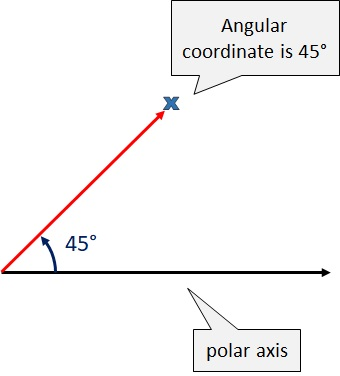

```{r setup, include=FALSE}
options(htmltools.dir.version = FALSE)
```

```{r xaringan-themer, include=FALSE, warning=FALSE}
library(xaringanthemer)
style_mono_accent(
  base_color = "#081d58",
  text_bold_color = "#ce1256",
  title_slide_text_color = "#edf8b1",
  header_font_google = google_font("Josefin Sans"),
  base_font_size = "20px",
  text_font_size = "1.5rem"
 #text_font_google   = google_font("Montserrat", "300", "300i")
 # code_font_google   = google_font("Fira Mono")
)
```


# Introduction

- Position scales: How to place data points in the plot.

<!--To make any sort of data visualization, we need to define position scales, which determine where in a graphic different data values are located. We cannot visualize data
without placing different data points at different locations,-->
  
- Arrangement of axes

     - horozontal x-axis and a vertical y-axis.

     - y-axis run at an acute angle relative to the x-axis.
     
     - one axis run in a circle and the other run radially.

<!--For example, we could have the y axis run at an acute angle relative to the x axis-->
  


## Definition: coordinate systems

"The combination of a set of position scales and their relative geometric arrangement is called a coordinate system." (Claus O. Wilke)

---

class: middle, inverse, center

# Cartesian Coordinates


---

### 2D Cartesian coordinate system

- Two orthogonal axes (horizontal x-axis, vertical y-axis).

<!--The most widely used coordinate system for data visualization is the 2D Cartesian coordinate system.-->

- If X and Y axes are measured in the same units, the grid spacing for the two axes should be equal. The plot area should be a perfect square.

.pull-left[

```{r, eval=FALSE}
library(ggplot2)
ggplot(data=iris, 
       aes(x=Sepal.Length, 
           y=Sepal.Width))+
  geom_point()+
*  theme(aspect.ratio = 1)
```
]

.pull-right[
```{r, echo=FALSE, fig.height=5}
library(ggplot2)
ggplot(data=iris, aes(x=Sepal.Length, y=Sepal.Width))+
  geom_point()+theme(aspect.ratio = 1)
```

]

---

### 2D Cartesian coordinate system (cont.)

Cartesian coordinate systems are invariant under linear transformations.

<!-- What happens if you change the units of your data? A change in units is a linear transformation, where we add or substract a number to or from all data values and/or multiply all data values with another number. Cartisian coordinate systems are invariant under such linear transformations. Therefore, you can change the units of your data and the resulting figures will not change as long as you change the axes accordingly.Even though the grid lines are in different
locations and the numbers along the axes are different, the two data visualizations
look exactly the same.-->

.pull-left[
```{r, fig.height=5}
ggplot(data=iris, 
       aes(x=Sepal.Length, y=Sepal.Width))+
  geom_point()+theme(aspect.ratio = 1)
```
]
.pull-right[
```{r, fig.height=5}
ggplot(data=iris, 
       aes(x=Sepal.Length*100, y=Sepal.Width*100))+
  geom_point()+theme(aspect.ratio = 1)
```

]

---

### 2D Cartesian coordinate system (cont)

When two different types of variables are mapped to $X$ and $Y$ the plotting area can be stretched or compressed one relative to the other to maintain a valid visualization of the data.

Example: X-Temperature, Y-Date

```{r, fig.height=4, message=FALSE, echo=FALSE}
# Dummy data
data <- data.frame( day = as.Date("2017-06-14") - 0:364,
  value = runif(365) + seq(-140, 224)^2 / 10000
)

ggplot(data, aes(x=day, y=value)) + geom_line() + xlab("Date") + ylab("Temperature")

```

---

### 2D Cartesian coordinate system (cont)

.pull-left[

**Square grid**

```{r, echo=FALSE,out.width="70%"}
ggplot(data, aes(x=day, y=value)) + geom_line() + xlab("Date") + ylab("Temperature") +theme(aspect.ratio = 1)

```


]

.pull-right[

**Rectangular grid**

```{r, echo=FALSE, out.width="200%", fig.height=2}
ggplot(data, aes(x=day, y=value)) + geom_line() + xlab("Date") + ylab("Temperature") 

```

```{r, echo=FALSE, out.width="200%", fig.height=2, message=FALSE, warning=FALSE}
library(mozzie)
library(forecast)
ts <- as.ts(mozzie$Colombo, frequency=52)
autoplot(ts)

```

]

---

# Nonlinear Axes

```{r, comment=NA}
x <- c(1, 3.2, 12, 35, 100, 1000); x
log_10_x <- log(x, base=10); log_10_x
```

```{r, comment=NA, fig.height=3.5, echo=FALSE}
df <- data.frame(data=c(x,log_10_x), label=c(rep("original data, linear scale", 6), rep("log-transformed data, linear scale", 6)))
df$label<- factor(df$label, levels =c("original data, linear scale", "log-transformed data, linear scale"))
ggplot(df, aes(y=data, x=label))+geom_point()+facet_wrap(.~label, scales = "free")

```

<!--The first is to respond to skewness towards large values; i.e., cases in which one or a few points are much larger than the bulk of the data-->

---

### Nonlinear Axes (Cont.)

.pull-left[
```{r, comment=NA, echo=FALSE,  fig.height=5}
df <- data.frame(data=c(x,log_10_x), label=c(rep("1. original data, linear scale", 6), rep("2. log-transformed data, linear scale", 6)))
df$label<- factor(df$label, levels =c("1. original data, linear scale", "2. log-transformed data, linear scale"))
ggplot(df, aes(y=data, x=label))+geom_point()+facet_wrap(.~label, scales = "free")

```

]

.pull-right[

```{r, echo=FALSE, fig.height=5}
df2 <- data.frame(data_x=x, logx=log_10_x)
p1 <- ggplot(df2, aes(y=log_10_x, x=""))+geom_point()+
  theme(axis.text.y = element_blank())+geom_text(aes(label=x),hjust=0, vjust=0)+
  ggtitle("3. Original data on logarithmic scale")+
  ylab("x")
```

```{r, echo=FALSE, fig.height=5}
df2 <- data.frame(data_x=x, logx=log_10_x)
p2 <- ggplot(df2, aes(y=log_10_x, x=""))+geom_point()+
  theme(axis.text.y = element_blank())+geom_text(aes(label=x),hjust=0, vjust=0)+ggtitle("4. Incorrect axis title")
library(patchwork)
p1|p2
```
]

---

- Frist 3 plots are correct. Fourth graph is incorrect.

- No difference between plotting the log-transformed data on a
linear scale or plotting the original data on a logarithmic scale. The only difference lies in labelling values. 

- First two are preferable.

- Third graph: high mental burden when reading the graph.


<!--Mathematically, there is no difference between plotting the log-transformed data on a
linear scale or plotting the original data on a logarithmic scale. The only
difference lies in the labeling for the individual axis ticks and for the axis as a whole. In most cases, the labeling for a logarithmic scale is preferable, because it places less
mental burden on the reader to interpret the numbers shown as the axis tick labels.
There is also less of a risk of confusion about the base of the logarithm. When working
with log-transformed data, we can get confused about whether the data was transformed
using the natural logarithm or the logarithm to base 10. And it’s not
uncommon for labeling to be ambiguous—e.g., log(x), which doesn’t specify a base at
all. I recommend that you always verify the base when working with log-transformed
data. When plotting log-transformed data, always specify the base in the labeling of
the axis.-->

---

# Transformations

Both logarithm scale and square-root scale compresses larger range into a smaller range.

- Logarithmic scales 

> When the dataset contains wide range of values.

<!--There are two main reasons to use logarithmic scales in charts and graphs. The first is to respond to skewness towards large values; i.e., cases in which one or a few points are much larger than the bulk of the data. The second is to show percent change or multiplicative factors.-->

- Square-root scale

> When data contains 0, use square-root transformation.

---

# Logarithmic scales 

Logarithmic scales can emphasize the rate of change in a way that linear scales do not. Italy seems to be slowing the corona virus infection rate, while the number of cases in Spain continues to double every few days.

.pull-left[
```{r, comment=NA, message=FALSE, echo=FALSE, fig.height=5}
library(coronavirus)
library(magrittr)
library(tidyverse)
data("coronavirus")
italy <- coronavirus %>%
 filter(type == "confirmed", country == "Italy",  date > "2020-02-21" & date < "2020-03-10") 
usa <- coronavirus %>%
 filter(type == "confirmed", country == "Spain", date > "2020-02-21" & date < "2020-03-10") 
df <- bind_rows(italy, usa)
ggplot(data=df, aes(x=date, y=cases, colour=country))+geom_line()+scale_color_manual(values=c('#1b9e77','#d95f02'))
```
]


.pull-right[
```{r, comment=NA, message=FALSE, echo=FALSE, fig.height=5}
library(coronavirus)
ggplot(data=df, aes(x=date, y=log(cases), colour=country))+geom_line()+scale_color_manual(values=c('#1b9e77','#d95f02'))
```
]

<!--At a quick glance, the rate of spread in the Spain looks similar to Italy’s, at least when plotted on a linear scale. But on a logarithmic scale, it is instantly apparent that the number of Americans becoming infected continues to double every three days or so. That indicates that the limited measures taken until recently did not sever social contact enough to slow the spreading. The U.S. curve has even bent upward in the last few days — an even faster exponential growth — perhaps reflecting more widespread testing.-->


---

# Coordinate Systems with Curved Axes


We specify positions through **angles** and **radial distance** from the origin.

---

.pull-left[

**1. Cartesian coordinate system**

```{r, comment=NA, message=FALSE, warning=FALSE, echo=FALSE, fig.height=5}
library(ggplot2)
#### Make example data
set.seed(20205)
r<-runif(50,-100,100) # radial coordinates
theta<-runif(50,0,2) # theta
a<-runif(50,1,20)
b<-runif(50,1,20)
# Convert r and theta to cartesian:
x<-r*cos(theta*pi)+1000 # x-coordinate of ellipse foci
y<-r*sin(theta*pi) # y-coordinate of ellipse foci
angle.random<-runif(50,min=0,max=2) # random angle for ellipsis rotation
df<-as.data.frame(cbind(r,theta,x,y,a,b,angle.random))
df$group <- c(rep("A", 10), rep("B", 40))
df <- data.frame(x=c(0, 1, 2, 3, 10), y=c(0, 1, 2, 5, 20))
ggplot(df,aes(x,y))+
geom_point(aes(x,y))+theme(aspect.ratio = 1)

```

]

.pull-right[

**2. Polar coordinate system**

```{r, comment=NA, echo=FALSE, fig.height=5}
ggplot(df,aes(x,y))+
geom_point(aes(x,y))+coord_polar()
```

]

We have taken the x coordinates from (1) and used them
as angular coordinates and the y coordinates from part (1) and used them as radial
coordinates. The circular axis runs from 0 to 10 in this example, and therefore x = 0 and
x = 10 are the same locations in this coordinate system.

---

## Coordinate Systems with Curved Axes (cont.)



A Polar chart draws the x and y coordinates in each series as ($\theta$,$r$), where $\theta$ is amount of rotation from the origin and $r$ is the distance from the origin.
---

## Coordinate Systems with Curved Axes (cont.)

**Monthly anti-diabetic drug sales in Australia from 1991 to 2008.**

```{r, comment=NA, fig.height=5}
autoplot(fpp2::qcement)
```


---

## Coordinate Systems with Curved Axes (cont.)

### Seasonal plots

- Emphasize seasonal patterns and show changes in these patterns over time.

- Seasonal plot is similar to a time plot except that the data are plotted against the individual “seasons” in which the data were observed. 

- Both plots illustrate a sharp decrease in values in February.

- Notice the colour scale!!!

---

.pull-left[

```{r, comment=NA, echo=FALSE, message=FALSE, warning=FALSE, fig.height=5}
library(forecast)
library(fpp2)
ggseasonplot(a10, year.labels=FALSE, continuous=TRUE)


```

]

.pull-right[

```{r, comment=NA, echo=FALSE, message=FALSE, warning=FALSE, fig.height=5}
ggseasonplot(a10, year.labels=FALSE, continuous=TRUE, polar = TRUE)

```


]

---

.pull-left[


```{r, comment=NA, echo=FALSE, message=FALSE, warning=FALSE, fig.height=4}

ggseasonplot(a10, year.labels=FALSE, continuous=TRUE)

ggseasonplot(a10, year.labels=FALSE, continuous=TRUE, polar = TRUE)

```

]

.pull-right[

- Polar coordinates are useful for data of a periodic nature (values at
one end of the scale can be meaningfully joined to data values at the other end).

- The polar version
shows how similar the sales are in December and January. In the Cartesian coordinate system, this fact is
obscured because the values in December and in January are
shown in opposite parts of the graph.
]


---

### Coordinate Systems with Curved Axes (cont.)

.pull-left[


```{r, comment=NA, echo=FALSE, message=FALSE, warning=FALSE, fig.height=3}

ggseasonplot(a10, year.labels=FALSE, continuous=TRUE)

ggseasonplot(a10, year.labels=FALSE, continuous=TRUE, polar = TRUE)

```

]

.pull-right[

- What is the angular coordinate?

- What is the radial coordinate?
]

---

# Coordinate systems in ggplot2

1) `coord_cartesian()`: Zooming into a plot

```{r, comment=NA, warning=FALSE, message=FALSE, fig.height=3, fig.width=8}
base1 <- ggplot(iris, aes(Sepal.Length, Sepal.Width)) + 
  geom_point() + 
  geom_smooth()+ggtitle("base1")
# Scaling to 5--7 throws away data outside that range
base2 <- base1 + scale_x_continuous(limits = c(5, 7))+ggtitle("base2")
# Zooming to 5--7 keeps all the data but only shows some of it
base3 <- base2 + coord_cartesian(xlim = c(5, 7))+ggtitle("base3")
base4 <- base2 + coord_cartesian(ylim = c(2, 3.5))+ggtitle("base4")
library(patchwork)
base1|base2|base3|base4
```

<!--Setting coordinate system limits is like looking at the plot under a magnifying glass.-->

---

### Coordinate systems in ggplot2 (cont.)

2) `coord_flip()`:  Flipping the axes

```{r, comment=NA, message=FALSE, fig.height=3.5}
base1 <- ggplot(iris, aes(x=Sepal.Length, y=Sepal.Width)) + 
  geom_point() + geom_smooth()+ggtitle("base1")
# curve is fitted to the original data, and then rotates
base2 <- ggplot(iris, aes(x=Sepal.Length, y=Sepal.Width)) + 
  geom_point() + geom_smooth()+
  coord_flip()+ggtitle("base2")
# curve is fit to the rotated data
base3 <- ggplot(iris, aes(x=Sepal.Width, y=Sepal.Length)) + 
  geom_point() + geom_smooth()+ggtitle("base3")
base1|base2|base3
```

---

3) `coord_fixed()`: Equal scales

A fixed scale coordinate system forces a specified ratio between the physical representation of data units on the axes.

**ratio:**	aspect ratio, expressed as $\frac{y}{x}$

---

```{r, comment=NA, message=FALSE, fig.height=5}
p <- ggplot(mtcars, aes(mpg, wt)) + geom_point()
```

.pull-left[
```{r, comment=NA, message=FALSE, fig.height=5}
p + coord_fixed(ratio = 1)
```
]

.pull-right[
```{r, comment=NA, message=FALSE, fig.height=5}
p + coord_fixed(ratio = 5)
```
]


---

### Non-linear coordinate with ggplot2

```{r, warning=FALSE, message=FALSE, comment=NA, fig.height=5}
#Acknowledgement- ggplot2: Elegant Graphics for Data Analysis Hadley Wickham
rect <- data.frame(x = 50, y = 50)
line <- data.frame(x = c(1, 200), y = c(100, 1))
base <- ggplot(mapping = aes(x, y)) + 
  geom_tile(data = rect, aes(width = 50, height = 50)) + 
  geom_line(data = line) + 
  xlab(NULL) + ylab(NULL)
base1 <- base + ggtitle("base1")
base2 <- base + coord_polar("x") + ggtitle("base2 (line 50-60)")
base3 <- base + coord_polar("y") + ggtitle("base3 (line:  60-75)")
base1|base2|base3
```


---

## Pie Chart vs Bar Chart

The polar coordinates gives rise to pie charts, radar charts, etc.

### sample dataset

.pull-left[
```{r, comment=NA}
# Load ggplot2
library(ggplot2)
library(dplyr)

# Create Data
data <- data.frame(
  group=LETTERS[1:5],
  value=c(13,7,9,21,2)
)

data

```
]

.pull-right[
```{r, comment=NA}
# Compute the position of labels
data <- data %>% 
  arrange(desc(group)) %>%
  mutate(prop = value / sum(data$value) *100) 
data
```
]

---

### Pie Chart vs Bar Chart

.pull-left[

```{r, comment=NA, message=FALSE, warning=FALSE, fig.height=3}
# Basic barchart
ggplot(data, aes(x="", y=prop, 
                 fill=group)) +
  geom_bar(stat="identity", 
           width=1, color="white") 
```

]

.pull-right[

```{r, comment=NA, message=FALSE, warning=FALSE, fig.height=3}
# Basic pie chart
ggplot(data, aes(x="", y=prop, fill=group)) +
  geom_bar(stat="identity", width=1, color="white") +
  coord_polar("y", start=0)
```


]

Angles are harder read accurately than aligned bars.

---

## Map projections: `coord_map()` 

- This is another use of polar coordinates.

- `coord_map` projects a portion of the earth, which is approximately spherical, onto a flat 2D plane using any projection defined by the `mapproj` package

- The earth is a sphere and its locations are specified by their longitude and latitude. Plotting raw latitude and longitude as Cartesian axes is
misleading due to the spherical shape of the globe. Hence, we project data to  balances between conserving areas or angles relative to the true shape lines on the globe.

---

#### Map projections (cont.)

```{r}
world <- map_data("world")
worldmap <- ggplot(world, aes(long, lat, group = group)) + geom_path() +
  scale_y_continuous(NULL, breaks = (-2:3) * 30, labels = NULL) + scale_x_continuous(NULL, breaks = (-4:4) * 45, labels = NULL)

w1 <- worldmap + coord_map()
# Some crazier projections
w2 <- worldmap + coord_map("ortho")
```

.pull-left[
```{r, comment=NA, message=FALSE, warning=FALSE, fig.height=4, echo=FALSE}
w1
```

]

.pull-right[
```{r, comment=NA, message=FALSE, warning=FALSE, fig.height=4, echo=FALSE}
w2
```

]
